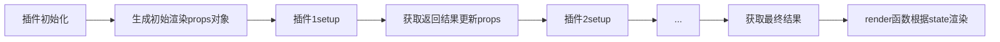

# 概述

为了简化低代码平台用户配置流程和适配平台提供能力，需要对 UI 组件做二次的封装，为了让组件二次封装能力扩展变得简单与稳定，根据vue 提供的 `composition api` 构建了插件化拓展开发方案， 用户只需要关心，需要扩展那些属性，对应如何渲染原始组件; 

> 此封装方案 `@lcap/vue2-utils/plugins` 目前基础组件内部使用状态，暂时不发布 公共 NPM 包， 源码地址如下 [GitHub 地址](https://github.com/netease-lcap/ui-libraries/tree/develop/packages/vue2-utils/src/plugins)

以 `el-button` 为例，现在需要通过 `shape` 来控制按钮的形状 （圆角按钮、圆形按钮等）,那么我只需要将 `shape` 替换到组件原有的 `circle` 和 `round` 属性即可, 示例代码如下：

```typescript
import { type NaslComponentPluginOptions } from '@lcap/vue2-utils/plugins';
export const useShape: NaslComponentPluginOptions = {
  props: ['shape'], // 扩展新增shape 属性
  setup: (props) => {
    // 响应shape 参数变化设置 circle 与 round
    const circle = props.useComputed('shape', (shape) => {
      return shape === 'circle';
    });

    const round = props.useComputed('shape', (shape) => {
      return shape === 'round';
    });

    return { // 给el-button 绑定 circle 与 round 参数
      circle,
      round,
    };
  },
};
```

## 插件化开发

### 注册组件

```typescript
import Button from 'element-ui/lib/button';
import { registerComponent } from '@lcap/nasl-hoc-vue/index';
import * as plugins from './plugins';   // 加载插件map

// 对ElementUI Button 基于插件能力封装
export const ElButton = registerComponent(Button, plugins, {});
```

* registerComponent(Component, plugins, options);
* Component 原始组件
* plugins   插件map
* extendInfo 继承原组件部分信息

```typescript
interface NaslComponentExtendInfo {
  /**
   * 组件支持的插槽名称，默认是 ['default'],
   * vue 中默认使用scopedSlots 同一做slot 透传，但是element-ui 中有很多根据 this.$slots 的判断， 所以需要将组件支持的slot 在配置中列出来
   */
  slotNames?: string[];
  /**
   * 需要扩展监听的组件事件名称, 会使用 `nativeOn` 进行监听
   */
  nativeEvents?: string[];
  /**
   * 代理组件提供的 method 方法名称
   */
  methodNames?: string[];
}
```

### 插件api

```typescript
export interface NaslComponentPluginOptions {
  /**
   * 插件名称，默认使用 export 的名称
   */
  name?: string;

  /**
   * 扩展组件参数名称
   */
  props?: string[];

  /**
   * vue composition setup 执行是函数，用户监听数据变化， 
   */
  setup: PluginSetupFunction<string, any>;

  /**
   * 插件排序，默认 4, 越小越先执行
   * 排序规范， 扩展参数 建议order 设置为 2或 3，修改 slot或者 render 等， 建议设置 7 - 9
   */
  order?: number;

  /**
   * 是否仅在页面编辑器中运行
   */
  onlyUseIDE?: boolean;
}
```

setup 函数仅在组件 `created` 是运行，用于注册参数响应规则；入参有两个：

* props: 不可变对象，只允许通过提供方法来获取属性
  * `props.useComputed(propKey | propKey[], compute(...value[]) => any)`  等同于 `vue computed` 通过传入的组件属性，计算生成渲染属性;
  * `props.useRef((propKey | propKey[], compute(...value[]) => any) )` 与computed 类似， useComputed返回值是只读的，这个返回值是可通过
  `.value = `来修改的，也会触发后续的响应函数；
  * `props.get(propKey)` 获取组件属性值，在事件(onClick)或插槽（slotDefault） 中使用此方法，获取当前值；
* ctx: 组件上下文， 目前只提供以下
  * h  创建 vnode 函数，使用的是 vue.$createElement;
  * isDesigner  是否是页面设计器环境；

setup 返回对象如下

```typescript
export interface PluginSetupFunctionReturn {
  /**
   * 组件属性key, 这里统一做了处理转成驼峰，例如， select-value,这应该是 selectValue
   * 事件属性格式为 onXXX
   * 插槽格式为 slotXXX
   */
  [key: string]: Ref<any> | ComputedRef<any> | any,
  /**
   * 渲染前从props 移除key，已使用的属性透传到组件上
   * 例如：el-button  icon属性，我们已经将icon 转为 组件写入到slotDefault中，这里就需要删除
   */
  [$deletePropList]?: string[];
  /**
   * 对组件渲染结果进行包装
   */
  [$render]?: (resultVNode: VNode, h: CreateElement, context: any) => VNode;
  /**
   * 向$ref 实例中注册方法或刻度属性
   */
  [$ref]?: PluginSetupRef;
}
```

## 插件运行机制



## 扩展案例

### 扩展 `text` 属性，作为 `el-button` slotDefault 使用

```typescript
import { type NaslComponentPluginOptions } from '@lcap/vue2-utils/plugins';

/* <el-button text="默认按钮" />*/
const useProps2Default = {
  props: ['text'],
  setup: (props) => {
    return {
      slotDefault: () => {
        // 获取当前 default 插槽内容
        const slotDefault = props.get('slotDefault');
        const defaultNode = slotDefault && slotDefault();
        
        /* 默认插槽没有内容使用 text 属性， 有内容就使用插槽内容 */

        if (isEmptyVNodes(defaultNode)) {
          return props.get('text') || null;
        }

        return defaultNode;
      },
    };
  },
  order: 2,
}
```

### element-ui 表单组件 v-model 同步支持 `.sync`

```typescript
import { type NaslComponentPluginOptions } from '@lcap/vue2-utils/plugins';

/* <el-input :value.sync="value" /> */
export const useVModelSync: NaslComponentPluginOptions = {
  setup: (props) => {
    return {
      onInput: (v) => {
        // 获取用户监听的 input
        const onInput = props.get('onInput');
        // update:value vue 内部处理，所以没有转换为 onXXX
        const onUpdateValue =  props.get('update:value');
        if (typeof onInput === 'function') {
          onInput(v);
        }

        if (typeof onUpdateValue === 'function' ) {
          onUpdateValue(v);
        }
      },
    }
  }
};
```

### 弹窗类组件，向ref 中注册 open close 方法，让ide 逻辑编辑中使用

```typescript
import { type NaslComponentPluginOptions } from '@lcap/vue2-utils/plugins';

/**
 * <el-dialog ref="dialog"></el-dailog>
 * 
 * this.$refs['dialog'].open();
 */
const usePopup: NaslComponentPluginOptions = {
  setup: (props) => {
    // 同时响应外部  visible属性设置的变化
    const opened = props.useRef('visible', (v) => (isNullOrUndefined(v) ? false : true));

    return {
      'visible': opened,
      [$ref]: {
        // ide 内使用
        designerControl() {
          opened.value = !opened;
        },
        open: () => {
          opened.value = true;
        },
        close: () => {
          opened.value = false;
        }
      }
    };
  }
};
```
