# 组件配置编写说明

<div class="yellowBlock">

此文档仅简单介绍api.ts如何编写， 详细文档介绍请参考[View Component API 书写指南和规范](../component/nasl-view-component.md)。

</div>

api.ts用于组件的配置面板生成、应用翻译等，整体的格式参考如下:


```typescript
/// <reference types="@nasl/types" />          // 引用 nasl 类型S

namespace nasl.ui {  // 命名空间，基础组件库 nasl.ui, 依赖库 extensions.[LibrayName].viewComponents

  /* 组件描述 */
  @ExtensionComponent({
    show: false,
  })
  @Component({
    title: '按钮',
    icon: 'button',
    description: '常用的操作按钮。',
  })
  export class ElButton extends ViewComponent {         // 组件名称为 tag 的大驼峰，例如 el-button => ElButton
    constructor(options?: Partial<ElButtonOptions>) {
      super();

      /* 提供调用方法描述 */
      @Method({
        title: '打开加载中',
        description: '打开加载中',
      })
      startLoading(): void {}

      @Method({
        title: '关闭加载中',
        description: '关闭加载中',
      })
      closeLoading(): void {}
    }
  }

  export class ElButtonOptions extends ViewComponentOptions {  // 参数类名需要与 组件class 名称对齐， 例如 ElButton -> ElButtonOptions, ElSelect -> ElSelectOptions
    /* 配置参数描述 */
    @Prop({
      group: '主要属性',
      title: 'Size',
      description: '尺寸',
      setter: { concept: 'InputSetter' },
    })
    size: nasl.core.String;

    /* 更多参数描述 */
    
    /* 事件描述 */
    @Event({
      title: '点击',
      description: '在元素上按下并释放任意鼠标按钮时触发。',
    })
    onClick: (event: {
      altKey: nasl.core.Boolean;
      button: nasl.core.Integer;
      clientX: nasl.core.Integer;
      clientY: nasl.core.Integer;
      ctrlKey: nasl.core.Boolean;
      metaKey: nasl.core.Boolean;
      movementX: nasl.core.Integer;
      movementY: nasl.core.Integer;
      offsetX: nasl.core.Integer;
      offsetY: nasl.core.Integer;
      pageX: nasl.core.Integer;
      pageY: nasl.core.Integer;
      screenX: nasl.core.Integer;
      screenY: nasl.core.Integer;
      which: nasl.core.Integer;
    }) => any;

    /* 插槽描述 */
    @Slot({
      title: 'default',
      description: '内容',
    })
    slotDefault: () => Array<nasl.ui.ViewComponent>;
  }
}
```

api.ts 需要提供**组件描述**、**属性描述**、**事件描述**、**插槽描述**、**方法描述**五个方面，使用不同注解。以下分别详细解释这五个方面。

## 1. 组件描述

使用`@Component`来标注，用于组件面板识别排列。参考如下：

- 自定义 icon 请参考文档[自定义组件面板图标​](../component/icon.md)；
- 依赖库中的组件无需定义 group ，默认将依赖库名称作为其分组。


```typescript
@Component({
  title: '按钮',                         // 组件显示名称
  icon: 'button',                       // 组件显示图标 （平台内置）
  description: '常用的操作按钮。',         // 组件描述
  /**
   * 组件分组，目前有
   * Display 展示 Form 表单 Selector 选择器 Layout 布局
   * Container 容器 Navigation 导航 Table 表格
   */
  group: 'Display',          // 依赖库使用 依赖库名称作为分组名称           
})
```

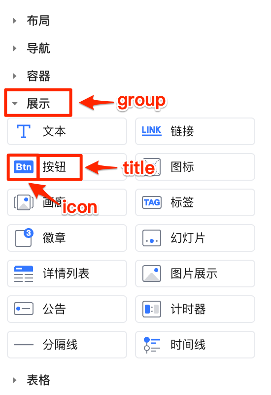

## 2. 属性描述

属性描述即参数配置，使用 `@Prop`来描述参数、渲染参数配置表单。参考如下：

```typescript
@Prop({
// 分组，目前支持 '数据属性' | '主要属性' | '交互属性' | '状态属性' | '样式属性' | '工具属性'
group: '主要属性',
// 属性配置面板显示名称
title: '尺寸',
// hover 到名称上显示具体描述
description: '尺寸',
// 属性设置器，支持参数设置器，请查看 “属性设置器”
setter: { },
})
size: nasl.core.String = 'small';  //  = ‘small’ 默认值 'small', nasl.core.String 参数类型，请查看“参数类型设置规范”
```

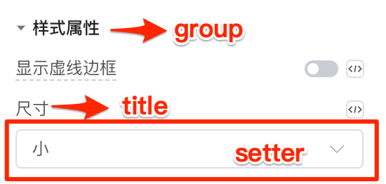

### 属性设置器

定义属性的设计器（setter）时，支持参数设计器，大致分为以下几种：

| 设置器名称   |    说明   | 支持类型  | 效果图  |
| :------- | :-------------- | :------- | :------ |
| **InputSetter**           | 输入框设置器（默认） | any | 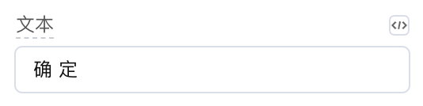 |
| **SwitchSetter**          | 开关设置器      | nasl.core.Boolean | 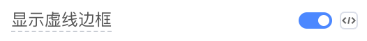  |
| **EnumSelectSetter**      | 枚举选择设置器   | nasl.core.String（字符串枚举形式）| 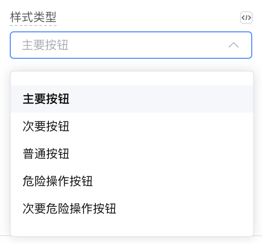 |
| **CapsulesSetter**        | 胶囊设置器      | nasl.core.String（字符串枚举形式）| 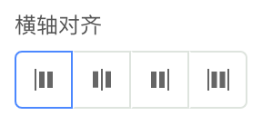  |
| **NumberInputSetter**     | 数字输入设置器   | nasl.core.Integer \| nasl.core.Decimal | 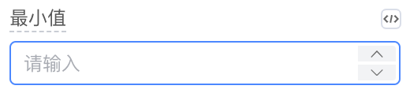  |
| **IconSetter**            | 图标设置器      | nasl.core.String  | 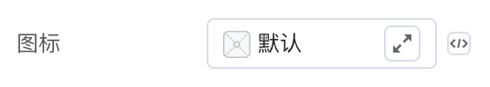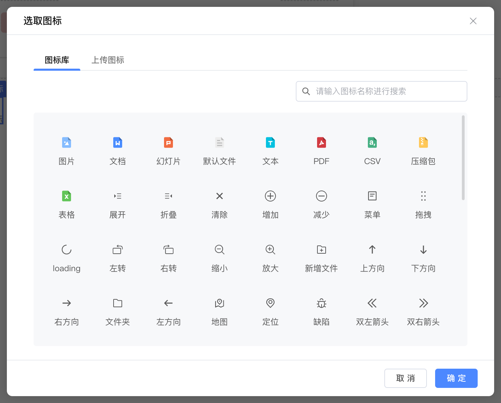 |
| **ImageSetter**           | 图片设置器      | nasl.core.String | 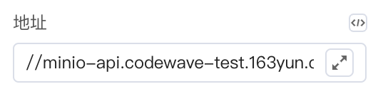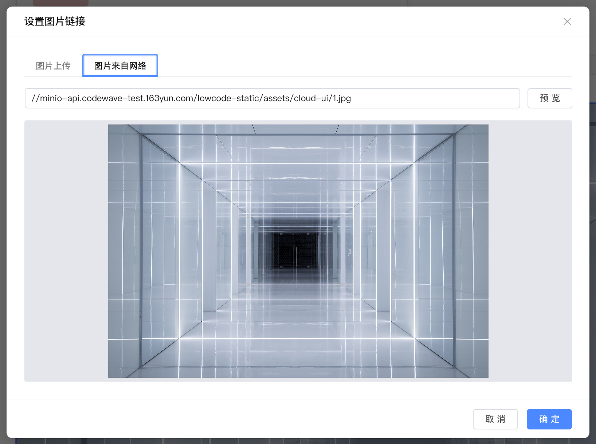 |
| **PropertySelectSetter**  | 属性选择设置器   | nasl.core.String | 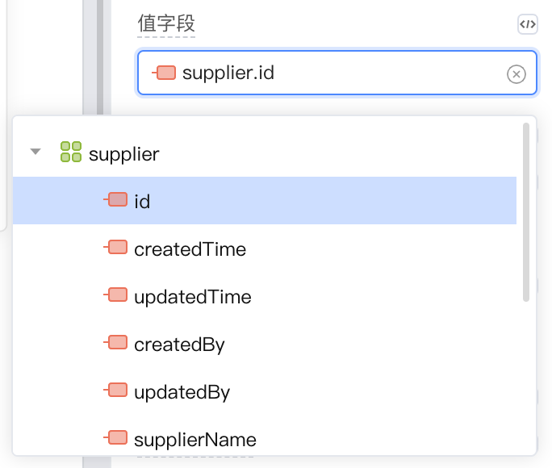 |
| **AnonymousFunctionSetter** | 匿名函数设置器 | (...args) => any |  |

**设计器 demo 参考：**

```typescript
Prop({
  group: '主要属性',
  title: '文本',
  description: '按钮内容',
  setter: { concept: 'InputSetter' },
})
text: nasl.core.String = '';
@Prop({
  group: '状态属性',
  title: 'Disabled',
  description: '是否禁用状态',
  setter: { concept: 'SwitchSetter' },
})
disabled: nasl.core.Boolean = false;

@Prop({
  group: '主要属性',
  title: '图标',
  description: '图标类名',
  setter: { concept: 'IconSetter' },
})
icon: nasl.core.String;

@Prop({
  title: '图标位置',
  description: '设置图标居左或居右显示',
  setter: {
    concept: 'EnumSelectSetter',
    options: [{ title: '左' }, { title: '右' }],
  },
})
iconPosition: 'left' | 'right' = 'left';
```

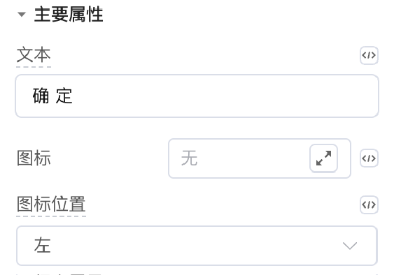

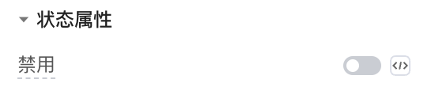

### 属性类型设置规范

使用api.ts属性描述，每个属性类型强制要求使用 nasl 提供的类型来写，支持类型如下：

```typescript
declare namespace nasl.core {
    export type Any = any;
    export type Boolean = boolean;
    export type Integer = number;
    export type Decimal = number;
    export type String = string;

    export class Binary {
        accept: 'Binary';
    }

    export class Date { // 组件接收的是string 类型
        accept: 'Date';
    }

    export class Time {// 组件接收的是string 类型
        accept: 'Time';
    }

    export class DateTime {// 组件接收的是string 类型
        accept: 'DateTime';
    }
}

// 集合类型
nasl.collection.List<T>

// union 类型
'small' | 'large' | 'medium'

// 匿名数据结构
{ list: nasl.collection.List<T>, total: nasl.core.Integer }
```

## 3. 事件描述

使用`@Event`来标注支持的事件，需要注意以下几点：

1.  事件名需要以on 开头的小驼峰，例如click 需要写为onClick，row-click需要写为onRowClick；
2.  事件参数仅允许有一个参数event，多个参数的情况需要转为一个匿名结构对象, 例如onSelect(value, item)需要转换为 onSelect({ value, item })。具体请参考[事件转换](../component/)；
3.  返回参数统一为void，匿名数据结构属性也必须使用 nasl 支持的类型；

```typescript
@Event({
    title: '改变后',
    description: '单选或多选值改变后触发',
})
onChange: (event: {
    value: nasl.core.String;
    values: nasl.collection.List<String>;
    oldValues: nasl.collection.List<String>; 
    items: nasl.collection.List<String>;
}) => void;
```

## 4. 插槽描述

使用`@Slot` 来描述组件插槽，插槽属性名以 slot 开头的小驼峰命名，例如默认插槽 slotDefault。

```typescript
export class XxxOptions extends ViewComponentOptions {
  // ...
  @Slot({
      title: 'Default',
      description: '内容',
  })
  slotDefault: () => Array<nasl.ui.ViewComponent>;
}
```

<div class="highlight">

具体请参考文档[插槽处理](../component/platform/slot.md)。

</div>


## 5. 方法描述

使用`@Method`来描述组件提供的方法，如果有参数 则需要@Param对参数进行描述

```typescript
@Method({
    title: '导出',
    description: '导出 excel 文件',
})
exportExcel(
    @Param({
        title: '当前页码',
        description: '当前页码',
    })
    page: nasl.core.Integer = 1,
    @Param({
        title: '每页条数',
        description: '每页条数',
    })
    size: nasl.core.Integer = 2000,
    // ... 
): void {}
```

> 参数描述中的 title 和 description 在IDE中不可见，但仍然建议将其作为标识为参数补全。

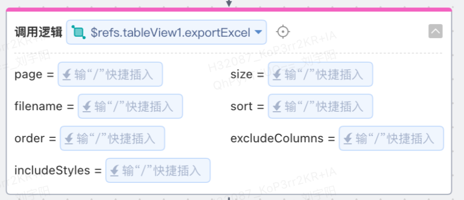

## 6. 子组件描述

<div class="highlight">

具体请参考文档[父组件和子组件](../component/platform/child.md)。

</div>


<style>
 .highlight {
      border: 1px solid #679CF8; /* 添加边框 */
      border-radius: 6px;
      background-color: #F8FCFF; /* 添加底色 */
      padding: 10px 20px 10px 20px;
      margin-bottom:20px;
      margin-top:20px;
      box-shadow: 0 2px 4px rgba(0, 0, 0, 0.2);
  }
  .yellowBlock {
    /* color: #FFFFFF; */
    border-left-width: 0.5rem;
    border-left-style: solid;
    padding: 0.1rem 1.5rem;
    margin:1rem 0;
    background-color: #fcf5e1;
    border-color: #eaaa08;
  }
  </style>