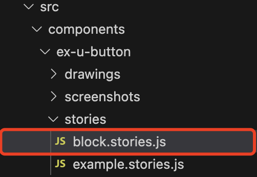
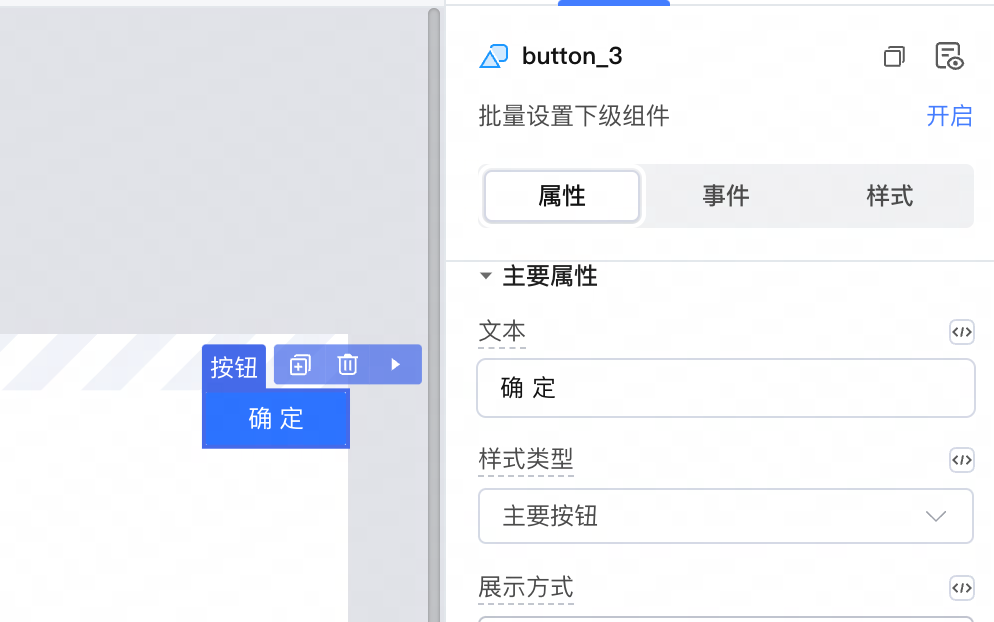
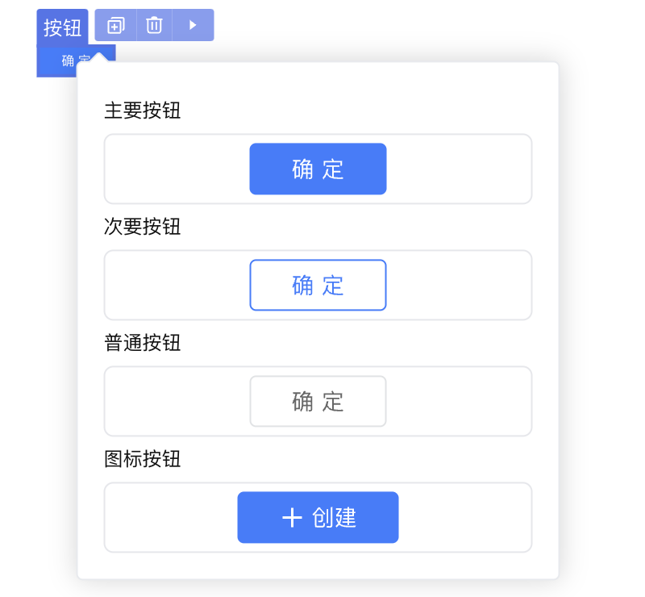

<script setup>
import { VTCodeGroup, VTCodeGroupTab } from '../../.vitepress/components'
</script>

# 区块示例说明

## 1. 功能说明

区块示例，是一段在IDE中拖拽组件到画布后默认生成的代码。需要在依赖库文件中定义区块示例，将其作为生成组件的基础模板，用于在IDE中向画布拖拽生成组件时将组件展示为示例定义的模样。

在依赖库文件中创建组件后，默认在生成一个区块示例代码。



以Button按钮组件为例：在 IDE 中拖拽按钮组件到画布后，会将按钮的文本（text）属性设置为 "确定"。



## 2. 功能实现

在 block.stories.js / block.stories.tsx 文件中定义示例。

<VTCodeGroup>
  <VTCodeGroupTab label="Vue2">

  `block.stories.js` 文件
  ```javascript
  export const Default = {
    name: '默认按钮',
    render: () => ({
      template: `<u-button text="确定"></u-button>`, // 这里的模板不要绑定外部参数与事件
    })
  };
  ```

  </VTCodeGroupTab>
  <VTCodeGroupTab label="React">

  `block.stories.tsx` 文件
  ```jsx
  export const Default = {
    name: '主要按钮',
    render: () => {
      return <Button type="primary" children="确定" />;
    },
  };
  ```

  </VTCodeGroupTab>
</VTCodeGroup>

## 3. 书写规范

### 3.1 区块示例的标准结构

每个区块示例都是一个StoryObj，必须包含 name、render属性。

<div class="highlight">

当依赖库模板选择 Vue2 时，Vue 会自动查找 render 下的template 。

</div>


### 3.2 区块示例的属性参数

区块示例中仅允许设置静态属性参数，不允许绑定函数或者绑定事件。

<VTCodeGroup>
  <VTCodeGroupTab label="Vue2">

  ```javascript
  // 以下为错误的示例
  export const Default = {
    name: '默认',
    render: () => ({
      data() {
        return {
          text: '确定'
        };
      },
      methods: {
        handleClick() {
        }
      },
      template: `<u-button :text="text" @click="handleClick"></u-button>`,
    })
  };
  ```

  </VTCodeGroupTab>
  <VTCodeGroupTab label="React">

  ```jsx
  // 以下为错误的示例
  export const Default = {
    name: '主要按钮',  // 区块示例名称
    render: () => {
      const text = '确定';
      const handleClick = () => {}
      return <Button type="primary" children={text} onClick={handleClick} />;  // 区块模板代码
    },
  };
  ```

  </VTCodeGroupTab>
</VTCodeGroup>

### 3.3 多区块示例

区块示例允许写多个，在拖拽组件后会弹出选择框供用户选择示例，示例图片为[组件运行截图](#_4-自动截图)；



## 4. 自动截图

打开终端，依次执行如下命令，根据block自动生成截图。截图作为拖拽组件后可选择示例的展示图。

1.  安装截图工具包。

    <VTCodeGroup>
      <VTCodeGroupTab label="npm">

      ```sh
      $ npm install puppeteer --save-dev
      ```

      </VTCodeGroupTab>
      <VTCodeGroupTab label="pnpm">

      ```sh
      $ pnpm add -D puppeteer 
      ```

      </VTCodeGroupTab>
      <VTCodeGroupTab label="yarn">

      ```sh
      $ yarn add puppeteer --dev
      ```

      </VTCodeGroupTab>
    </VTCodeGroup>


2.  启动dev服务

    ```sh
    npm run dev
    ```

3.  新建终端执行命令，开始批量截图。端口号需要和dev服务一致，`<folder>`指组件文件夹名称，例如 cwd-capslue。执行结束后在组件目录中会自动生成文件夹screenshots 并包含截图。

    ```sh
    npx lcap-scripts screenshot <folder> --port 8008
    ```


<style>
 .highlight {
      border: 1px solid #679CF8; /* 添加边框 */
      border-radius: 6px;
      background-color: #F8FCFF; /* 添加底色 */
      padding: 10px 20px 10px 20px;
      margin-bottom:20px;
      margin-top:20px;
      box-shadow: 0 2px 4px rgba(0, 0, 0, 0.2);
  }
</style>
