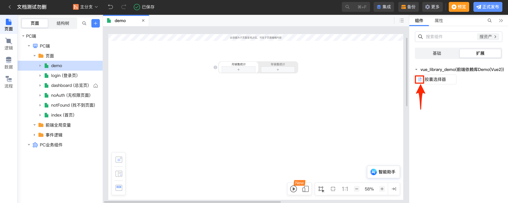
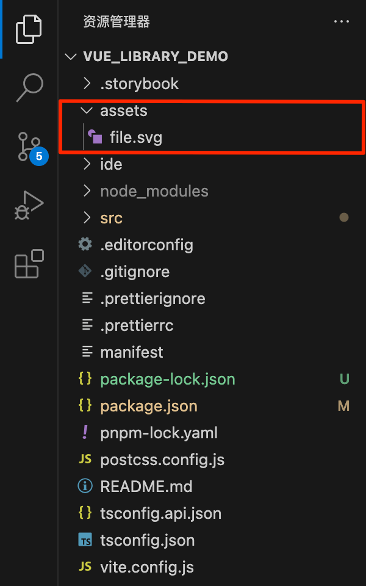
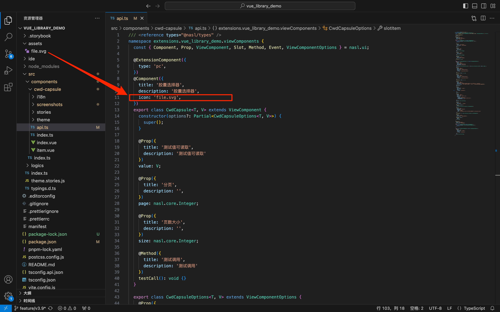

# 自定义组件面板图标

## 1. 功能说明

自定义在IDE右侧组件列表中展示的组件图标。



## 2. 功能实现

1.  在项目文件根目录下创建文件夹 assets ，在文件夹下添加.svg格式图标文件。

    

1.  在组件的 api.ts 文件中，通过 @Component 装饰器定义图标 icon 。icon对应的文件支持根据 assets 匹配路径。

    ```typescript
    @Component({
        icon: 'demo.svg',
    })
    ```

    