# container 配置说明

类型为 "container" 的组件搭配 [Slot ](../platform/slot.md)可以插入子节点。

```typescript
@ExtensionComponent({
  ideusage: {
    "idetype": "container"
  }
}）
```

下文以 vue 模板为例，展示配置和翻译器生层代码的匹配关系。React 相似。

## 示例

### 卡片组件

以 CloudUI 的卡片组件 [u-card](https://github.com/netease-lcap/ui-libraries/blob/test-v3.10.x/libraries/pc-ui/src/components/u-card.vue/index.js) 为例。

参考配置要求：

- 组件包含三个插槽；
- 禁止自动插入插槽。

参考配置书写：

由于disableSlotAutoFill配置了不自动插入槽位的插槽名，所以设计器只会自动在 default 和 title 插槽下插入可置入组件的槽位。

```typescript
@ExtensionComponent({
    ideusage: {
        idetype: "container",
        "disableSlotAutoFill": ["cover"]
    }
}
export class UCardOptions extends ViewComponentOptions {
  // ...
  @Slot({
      title: 'undefined',
      description: '插入默认的元素',
  })
  slotDefault: () => Array<nasl.ui.ViewComponent>;

  @Slot({
      title: '图片',
      description: '插入图片',
  })
  slotCover: () => Array<nasl.ui.ViewComponent>;

  @Slot({
      title: '标题',
      description: '插入文本或 HTML。',
  })
  slotTitle: () => Array<nasl.ui.ViewComponent>;
}
```

这段配置生成的vue模板如下：

```html
<u-card data-nodepath="c3f682566bb94d12ad71144c80d858d8" key="component-c3f682566bb94d12ad71144c80d858d8">
    <EmptySlot data-emptyslot-nodepath="c3f682566bb94d12ad71144c80d858d8"></EmptySlot>
    <template slot="title">
        <div data-nodepath="22e902143270453796cd6d94ee2f0e91">
            <EmptySlot data-emptyslot-nodepath="22e902143270453796cd6d94ee2f0e91"></EmptySlot>
        </div>
    </template>
</u-card>
```

需要注意的点：

- 组件内需要将 data-\* 的属性透传到生成的DOM节点上
- 组件插槽需要支持设计器内置的 EmptySlot 组件和普通html dom元素

### 数据表格组件

在一些特殊情况中，container类型的组件无法将 data-\* 的属性透传到生成的DOM节点上。以 CloudUI 的 表格列[u-tableview-column](https://github.com/netease-lcap/ui-libraries/blob/2e9708d13891015ae6b9ac33507fb77bb8b253b3/libraries/pc-ui/src/components/u-table-view.vue/api.ts#L1116)为例。

参考配置要求：

- 在IDE中可以完整的选中表格列。


参考配置书写：

组件分为表头和表格内容，为了能够同时选中表格头个表格内容，设计器提供了 selector 配置项，配置项通过向指定的插槽注入内置组件 HoistNodePath ，从而将 data-\*的属性复制到上层 cssSelector 可以匹配的 dom 元素。

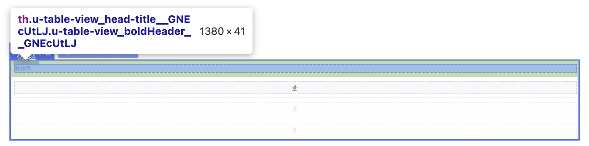

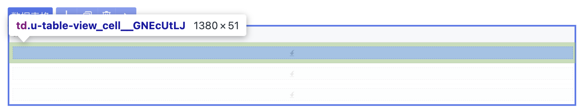

```typescript
@ExtensionComponent({
    "ideusage": {
        "idetype": "container",
         "selector": [
            {
                "expression": "this.getElement(el => el.slotTarget === 'title')",
                "cssSelector": "th"
            },
            {
                "expression": "this.getElement(el => el.slotTarget === 'cell')",
                "cssSelector": "td"
            },
            {
                "expression": "this.getElement(el => el.slotTarget === 'expand-content')",
                "cssSelector": "tr[class^='u-table-view_expand-content']"
            }
        ]
    }
})
```

这段配置生成的vue模板如下：

```html
<u-table-view-column field="entity1.updatedTime" key="component-613a75d05eb04790969d9fd1532eb5ab">
    <template #cell={...argus}>
        <HoistNodePath nodePath="613a75d05eb04790969d9fd1532eb5ab" topSelector="td" data-nodepath-multiple="true">
        </HoistNodePath>
        <div data-nodepath="55b20ff830b84a2bb1e4640a2c51496c">
            <EmptySlot data-emptyslot-nodepath="55b20ff830b84a2bb1e4640a2c51496c"></EmptySlot>
        </div>
    </template>
    <template #editcell={...argus}>
        <div data-nodepath="530ebd475ab742d5a7967376ae5132d7">
            <EmptySlot data-emptyslot-nodepath="530ebd475ab742d5a7967376ae5132d7"></EmptySlot>
        </div>
    </template>
    <template slot="title">
        <HoistNodePath nodePath="613a75d05eb04790969d9fd1532eb5ab" topSelector="th" data-nodepath-multiple="true">
        </HoistNodePath>
        <div data-nodepath="a556e6e3851b40578d12022f4d4e1ca3">
            <EmptySlot data-emptyslot-nodepath="a556e6e3851b40578d12022f4d4e1ca3"></EmptySlot>
        </div>
    </template>
    <template #expand-content={...argus}>
        <HoistNodePath nodePath="613a75d05eb04790969d9fd1532eb5ab"
            topSelector="tr[class^='u-table-view_expand-content']" data-nodepath-multiple="true"></HoistNodePath>
        <div data-nodepath="f5b3b0b27b6f43d7806d82ccd97660e2">
            <EmptySlot data-emptyslot-nodepath="f5b3b0b27b6f43d7806d82ccd97660e2"></EmptySlot>
        </div>
    </template>
    <template #expander={...argus}>
        <div data-nodepath="67149ae2ebd6428d89646a6fdc0c6905"><u-table-view-expander
                data-nodepath="cdd6d65d372149e994debc85c0969b85" data-enable-events="click"
                key="component-cdd6d65d372149e994debc85c0969b85" :item="argus.item"></u-table-view-expander></div>
    </template>
</u-table-view-column>
```

### 表单组件

设计器还提供了通过 “+” 来添加子组件的功能。以 CloudUI 的表单组件 [u-form](https://github.com/netease-lcap/ui-libraries/tree/test-v3.10.x/libraries/pc-ui/src/components/u-form.vue) 为例。

参考配置要求：

- 在IDE中可以选中表单添加表单分组和表单项。

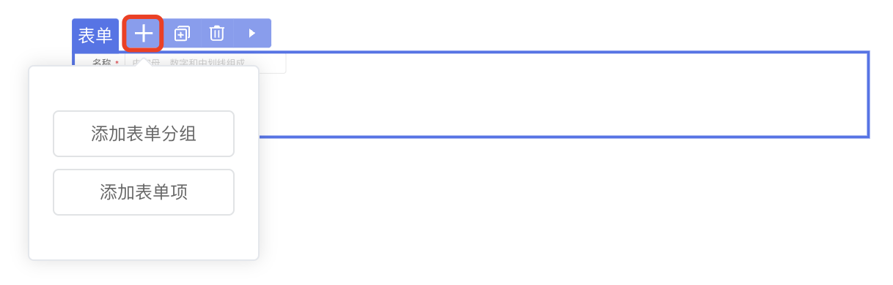

参考配置书写：

通过配置 structured 属性，配合slot配置中的 snippets 来配置子组件添加模板。

```typescript
@ExtensionComponent({
    "ideusage": {
         "idetype": "container",
         "structured": true
    }
})
export class UFormGroupOptions  extends ViewComponentOptions {
        ...
        @Slot({
          title: 'undefined',
          description: '插入`<u-form-item>`子组件。',
          emptyBackground: 'add-sub-large',
          snippets: [
              {
                  title: '表单分组',
                  code: '<u-form-group><template #title><u-text text="分组"></u-text></template><u-form-item><template #label><u-text text="表单项"></u-text></template></u-form-item></u-form-group>',
              },
              {
                  title: '表单项',
                  code: '<u-form-item><template #label><u-text text="表单项"></u-text></template></u-form-item>',
              },
          ],
      })
      slotDefault: () => Array<nasl.ui.ViewComponent>;
      ...
}
```

- structure: true 表示 snippet 插入到 "default" 插槽内；
- structure: "slotname" 表示 snippet 插入到 "slotname" 插槽内；
- structure: { slot: "slotname", empty: true } 表示即使空态也有槽位展示。

### 单选组组件

当具有 dataSource 属性的组件接入时，需要配置 dataSource 的展示形式。以 CloudUI 的单选组组件 [u-radios](https://github.com/netease-lcap/ui-libraries/tree/test-v3.10.x/libraries/pc-ui/src/components/u-radios.vue) 为例。

参考配置要求：

- 支持设置数据源。
- 支持在绑定数据源后拖拽插入子组件，使子组件动态展示。

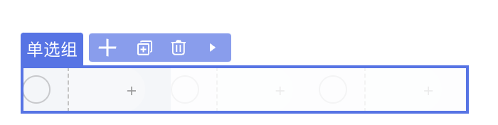

参考配置书写：

```typescript
@ExtensionComponent({
    "ideusage": {
        "idetype": "container",
        "structured": true,
        "dataSource": {
            "dismiss": "!this.getAttribute('dataSource') && this.getDefaultElements().length > 0",
            "display": 3,
            "loopRule": "nth-child(n+2)",
            "loopElem": "> label[class^='u-radios_radio']:not([data-nodepath])"
        },
        // ...
    }
})
```

这段配置生成的vue模板，及相关css样式如下：

```html
<u-radios data-nodepath="e19ce4d016414bada1b05a96b7157963" 
    key="component-e19ce4d016414bada1b05a96b7157963"
    :dataSource="[{},{},{}]" 
    class="ide-style1">
    <template #item={...argus}>
        <div data-nodepath="9474b8caced5485da6f788e1745d02ee">
            <EmptySlot data-emptyslot-nodepath="9474b8caced5485da6f788e1745d02ee"></EmptySlot>
        </div>
    </template>
</u-radios>
```

```css
.ide-style1>label[class^='u-radios_radio']:not([data-nodepath]):nth-child(n+2) {
    opacity: 0.2;
}

.ide-style1>label[class^='u-radios_radio']:not([data-nodepath]):nth-child(n+2),
.ide-style1>label[class^='u-radios_radio']:not([data-nodepath]):nth-child(n+2) * {
    pointer-events: none;
}
```

需要注意的是：

- 组件的dataSource 需要支持传入 \[{}, {}, {}] 形态的数据，display: 3 表示展示3个 '{}'
- loopRule 和 loopElem 用于拼接生成的 css 选择器，用于给后面几项的展示增加样式。
- dismiss 是当指定条件下，忽略dataSource的设置，即不传入 \[{}, {}, {}]，也不增加css样式。

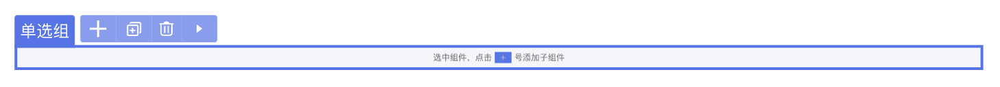

空态可由slot的配置emptyBackground生效，目前支持 'add-sub' 与 'add-sub-large'。

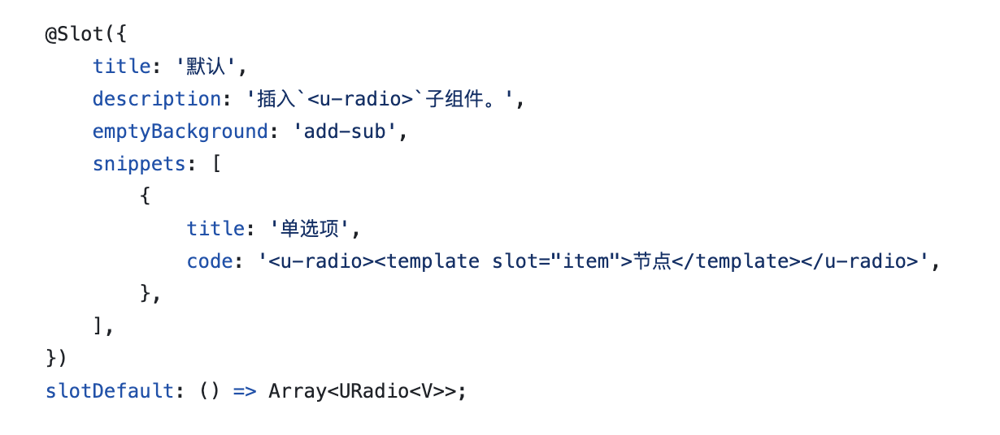

## 配置项说明

### containerDirection

选配，定义容器内部排列方向的表达式，与置入的指示线有关。

**示例**

以 CloudUI 的栅格布局组件的**栅格行** grid-layout和**栅格列** grid-layout-row 为例。

```typescript
@ExtensionComponent({
    "ideusage": {
        "idetype": "container",
        "structured": true,
        "dataSource": {
            "dismiss": "!this.getAttribute('dataSource') && this.getDefaultElements().length > 0",
            "display": 3,
            "loopRule": "nth-child(n+2)",
            "loopElem": "> label[class^='u-radios_radio']:not([data-nodepath])"
        },
        // ...
    }
})
```

**IDE 中的效果**

栅格行垂直方向依次排列，栅格列水平方向依次排列。

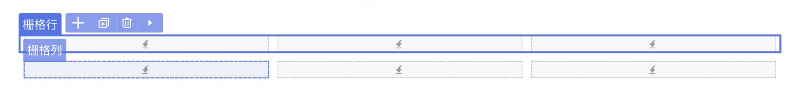

### translateBindingProperty

选配，定义可以显示绑定变量的属性。书写格式为 `"translateBindingProperty": Array[String]`，Array\[String]即属性名的数组。

**示例**

以 CloudUI 的选择器组件 [u-select](https://github.com/netease-lcap/ui-libraries/blob/test-v3.10.x/libraries/pc-ui/src/components/u-select.vue/index.js) 为例。

```typescript
@ExtensionComponent({
    ideusage: {
            "idetype": "container",
            "structured": true,
            "childAccept": "['u-select-item', 'u-select-group', 'u-select-divider'].includes(target.tag)",
            "events": {
                "click": true
            },
            "translateBindingProperty": ["value", "placeholder"]
        }
})
```

此处 translateBindingProperty 定义的分别为选择器的“选中值”和“占位符”属性，属性描述如下：

```typescript
@Prop({
  title: '选中值'
})
value: USelectOptions<T, V, P, M, C>['value'];
@Prop({
  group: '主要属性',
  title: '自动获取焦点',
  description: '设置是否自动获取焦点',
  docDescription: '控制是否在进入页面时聚焦到该组件',
  designerValue: false,
  setter: {
    concept: 'SwitchSetter'
  }
})
placeholder: nasl.core.String = '请选择';
```

**IDE 中的效果**

在IDE中，若为“占位符”属性 placeholder 绑定变量，则该属性允许传入平台内置的相关属性字符串。

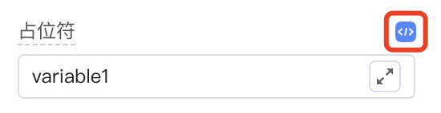


拖拽生成组件后，在页面设计器中生成的代码如下：

```html
<u-select data-nodepath="29d12b2924dc4217ae60dceb991e38a6" 
    data-enable-events="click" 
    :clearable="true"
    :placeholder="'{{ variable1 }}'" 
    :pageSize="50" 
    :emptyValueIsNull="true" 
    textField="text" 
    valueField="value"
    class="" key="component-29d12b2924dc4217ae60dceb991e38a6">

</u-select>
```

### elementSutando

选配，定义页面设计器中的替代组件，如果设计器中要展示的组件无法与原组件相同，则可以使用为设计器定制的组件作为替代。书写格式为：

```typescript
"elementSutando": {
    "component": "组件名",
    "condition": "使用替代组件的条件判断表达式",
    "selector": {
        "slot": String,
        "cssSelector": String,
}
```

**示例**

以 ElementUI 的弹框组件 [MessageBox](https://element.eleme.cn/#/zh-CN/component/message-box) 为例：只能通过element的API唤起，不是一个组件，如果要在设计器里编排，则需要写一个类似的组件作为替身。

```typescript
@ExtensionComponent({
    ideusage: {
      "idetype": "messager",
      "elementSutando": {
        "condition": true,
        "component": "ElMessageBoxDesigner",
        "selector": {
          "slot": "default",
          "cssSelector": ".el-message-box",
        },
        "useSlot": true,
      },
      "cacheOpenKey": "visible"
    }
  })
```

**IDE 中的效果**


### dataSource

选配，定义具有数据源的组件。书写格式为：

```typescript
"dataSource": {
    "dismiss": String,
    ""display": Integer,
    "loopElem": String
    "emptySlot": {
        "display": String,
        "condition": String,
        "component":String,
        "accept": Boolean
    }
},
```

- dismiss（选配）：忽略datasource的条件表达式。
- display：在设计器中展示的条数。例如`"display": 3`表示传入的是 "\[{}, {}, {}]"
- displayData：设计器中该组件传入的datasource的值。如果设置则display不生效，`"display": 3`等同于`"displayData": "[{}, {}, {}]"`。
- loopElem：该组件循环的具体DOM节点的css选择器
- emptySlot：没有绑定数据源时的占位设置

    - condition：使用占位组件的条件
    - component（选配）：占位的组件名称
    - accept：可置入的目标表达式
    - display（选配）: 如果使用了默认的占位组件的样式，可能的值为：'inline','block'，默认'block'。

具体示例请参考上文：[示例-单选组组件]()。

### parentAccept

选配，定义可以放入当前组件的父组件。书写格式为`"parentAccept"："判断表达式"`，例如要求组件只能置入到面包屑组件 u-crumb 中：

```typescript
"parentAccept": "target.tag === 'u-crumb'"
```

### childAccept

选配，定义可以放入子组件的组件。书写格式为`"parentAccept"："判断表达式"`或`"parentAccept"：Object`。

- 表达式形式：

```typescript
 "childAccept": "target.tag === 'Radio'",
```

- 对象形式：key为slot中配置的名字，value是表达式

```typescript
"childAccept": {
    "default": "this.getDefaultElements().length < 1",
    "menuItem": "target.tag === 'MenuItem'"
  }
```

### selector

选配，若存在无法将data-nodepath 传入顶层DOM节点，可以通过设置此项绕行，绕行是通过向具体组件内部放入一个能够根据css选择器向上查找DOM节点的组件X。书写格式为：

```typescript
"selector": [
    {
        "expression": String,
        "cssSelector": String
    },
]
```

selector 中可以为包含 expression 和 cssSelector 的对象或对象的数组。

- expression: 从当前节点查找塞入组件X的位置；
- cssSelector: X组件所使用的css选择器。

具体示例请参考上文：[示例-数据表格组件]()。

### structured

选配，定义当前组件的子组件的插入方式。书写格式为`"structured"：true`或`"structured"： false`或`"structured"： { slot: String, empty?: Boolean }`。

- true表示通过设计器内菜单中"+"插入；
- false表示通过拖拽插入；
- empty可以配置是否为此节点插入插槽。

如果在slotDefinitions 中配置了emptyBackground，则优先展示emptyBackground。具体示例请参考上文：[示例-表单组件]()。

### events

选配，定义页面设计器内支持的事件。书写格式为`"event"： { key: value }` 。

- key：表示事件名称，目前支持 click 或 mousedown；
- value：表示生效条件，支持 true、false以及表达式。

例如为折叠面板组件定义点击事件，支持点击后在设计器中打开和关闭折叠面板项：

```typescript
"events": {"click": true}
```


### additionalAttribute

选配，定义设计器内组件展示时额外传入的属性。书写格式为`”additionalAttribute“： { key: value }` 。

**示例**

要求取消 react modal 在设计器里的弹出动画：

```typescript
@ExtensionComponent({
    "ideusage": {
      "idetype": "modal",
      ...
      "additionalAttribute": {
        "transitionName": "''", 
        "maskStyle": "{{opacity: 1,animationDuration: '0s'}}"
      },
      "cacheOpenKey": "open"
    }
})
```

> 需要注意，传入的键值对将直接放入模板翻译结果，需要对 " 等特殊符号做转义。

**IDE 中的效果**

拖拽生成组件后，在页面设计器中生成的代码如下：

```html
<Modal okText="确定" cancelText="取消" 
        key="component-24445f4bd7be4acdb923d4e53c06fe58" 
        open={true} 
        transitionName=''
        maskStyle={{opacity: 1,animationDuration: '0s'}} 
        title={...} 
        footer={...}>
        ...
</Modal>
```

### displaySlotConditions

选配，定义结构树上插槽节点的展示条件。书写格式为`”displaySlotConditions“： { key: value }` 。不配置的插槽名称默认都展示，即为 true。

- key：插槽名称，同slots配置下的name属性
- value：插槽展示条件，支持 true, false, 及表达式

**示例**

比如 react form input组件，在 labelIsSlot 生效的情况的才在结构树上展示label插槽。注意插槽的显示隐藏需要通过组件本身来控制。

```typescript
ideusage: {
      "idetype": "container",
      "textholder": "value",
      "displaySlotConditions": {
        "default": false,
        "label": "this.getAttribute('labelIsSlot').value === true",
        "description": false,
        "extra": false
      }
  }
```

**IDE 中的效果**

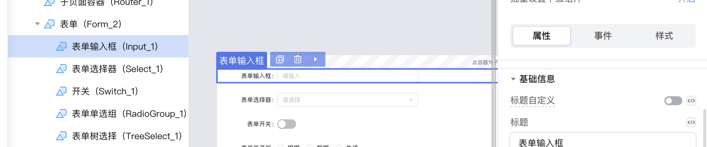

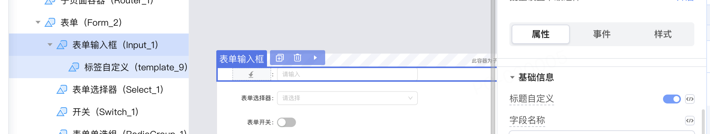

### namedSlotOmitWrapper

选配，定义插槽是否不翻译idv外包裹。设计器会给每个具名插槽上加一个div包裹，用于标识具名插槽的DOM节点，但有时因为样式，可能不需要这层包裹的div。书写格式为`"namedSlotOmitWrapper"：Boolean`。

### slotWrapperInlineStyle

选配，定义传入插槽外包裹的样式。书写格式为`"slotWrapperInlineStyle": { key: value }` 。

- key：插槽的名称；
- value：插槽外包裹的样式。

例如：上传组件放置文件信息的插槽为弹性布局容器。

```typescript
"slotWrapperInlineStyle": {
    "file-list": "display:flex"
}
```


### slotInlineStyle

选配，定义插槽的样式，书写格式为`"slotInlineStyle": { key: value }` 。

- key：插槽的名称；
- value：插槽的样式。

例如：分栏布局组件的布局栏高度。

```typescript
 "slotInlineStyle": {
    "default": "height:100%;"
}
```

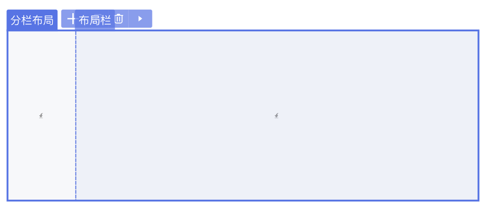

### displaySlotInline

选配，定义插槽外包裹使用行内样式的条件，书写格式为`"displaySlotInline":{ key: value }` 。

- key：插槽的名称；
- value：使用行内样式的条件，支持 true、false以及表达式。

例如：单选组的选项。

```typescript
"displaySlotInline": {
    "item": true
}
```

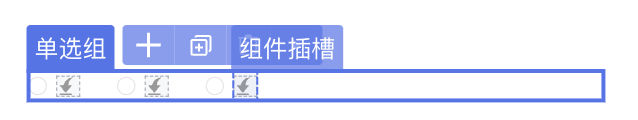

### disableSlotAutoFill

选配，定义禁止自动插入插槽。书写格式为：`"disableSlotAutoFill":String | { slot: String, expression?: expression, fill?: expression }`。

- slot：插槽的名称；
- expression：生效条件；
- fill：替换的内容。

例如：

```typescript
"disableSlotAutoFill": [{
    "slot": "title",
    "expression": "this.getAttribute('title')",
    "fill": "this.getAttribute('title').value"
}],
```

### useTemplateInDefaultSlot

选配，定义是否支持名为 default 的插槽为单个NASL节点。书写格式为`"useTemplateInDefaultSlot"：Boolean`。

例如组件列表中，明确需要名为default的NASL插槽节点。

```typescript
"useTemplateInDefaultSlot"：true
```

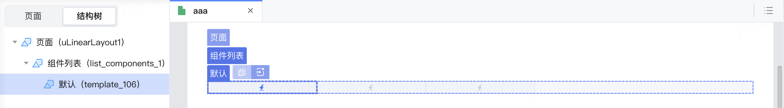

### expandWhenHesitate

选配，boolean，定义是否在悬停时撑开。书写格式为`"expandWhenHesitate"：Boolean`。

例如线性布局组件，悬停时撑开边缘，方便在边缘重合的情况下插入组件。

```typescript
"expandWhenHesitate"：true
```

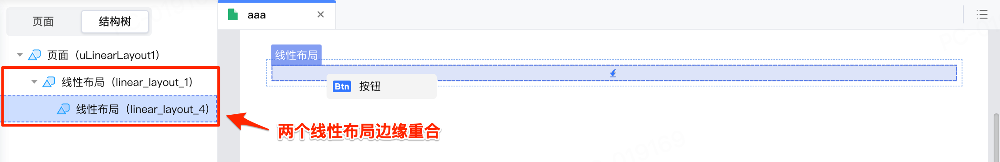

### iconEditor

选配，定义是否支持双击组件打开icon面板并设置icon。书写格式为`"iconEditor"：Boolean`，例如：

```typescript
"iconEditor"：true
```


### operator

选配，定义支持的操作配置，不配置时默认全支持。书写格式为：`“operator”: { copy?:expression, cut?: expression, duplicate?: expression, d2c?: expression }` ，expression 为生效的条件。

例如 vant 的单选组组件，其删除操作在radio-group设置了数据源的情况下禁止，但是不禁止直接子节点的删除。

```typescript
ideusage: {
    "idetype": "container",
    "operator": {
        "delete": "!this.getParent().getParent().getAttribute('dataSource')"
    }
}
```

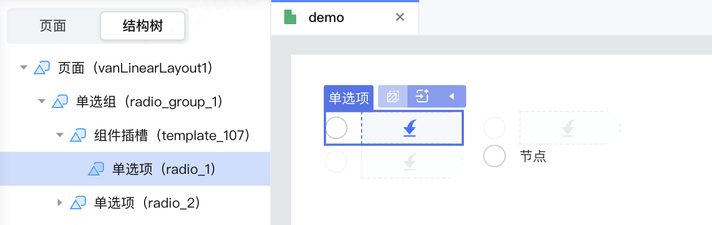

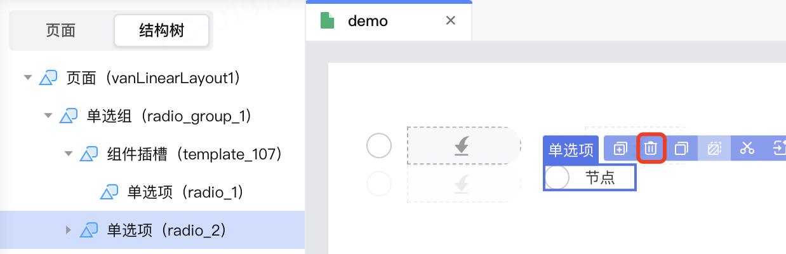

### useFxOrEg

选配，定义支持表达式和示例切换的属性。书写格式为`useFxOrEg: { property: String, displayAsAttr?: Boolean }` 。

- property：表示支持的属性名；
- displayAsAttr： 表示组件是否支持内部插入子元素。

例如：

```typescript
 "useFxOrEg":{"property": "text"}
```

> 示例中的 text 属性来源于 api.ts 中的属性描述，实现属性描述请参考[组件配置编写说明​](../api.md)。

在IDE中，若为文本属性 text 绑定变量，支持[切换显示表达式和示例数据](https://community.codewave.163.com/CommunityParent/fileIndex?filePath=20.%E5%BA%94%E7%94%A8%E5%BC%80%E5%8F%91%2F10.%E9%A1%B5%E9%9D%A2%E8%AE%BE%E8%AE%A1%2F16.%E7%A4%BA%E4%BE%8B%E6%95%B0%E6%8D%AE%EF%BC%88%E8%A1%A8%E8%BE%BE%E5%BC%8F%E5%8D%A0%E4%BD%8D%E7%AC%A6%EF%BC%89.md&version=3.13)。


