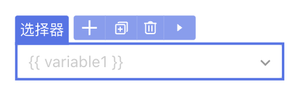
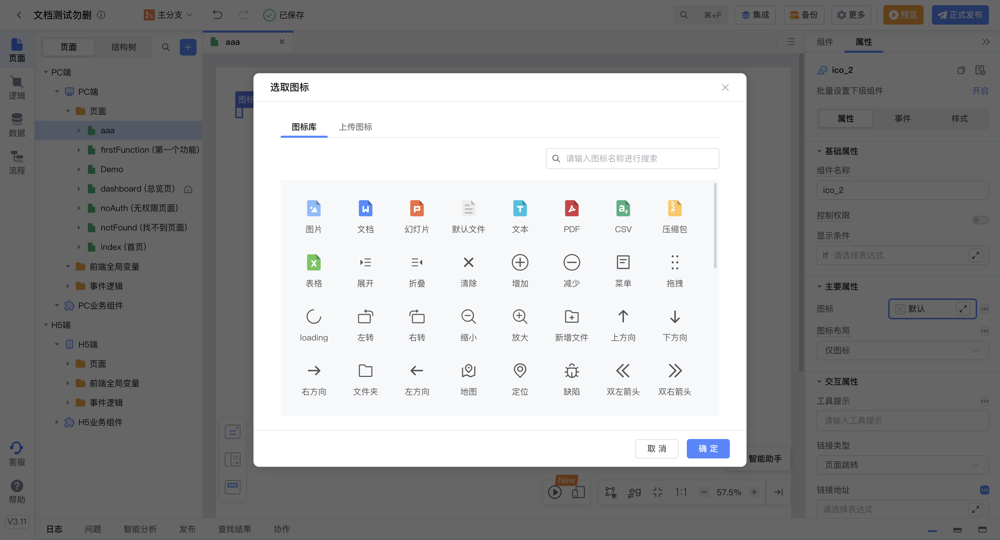
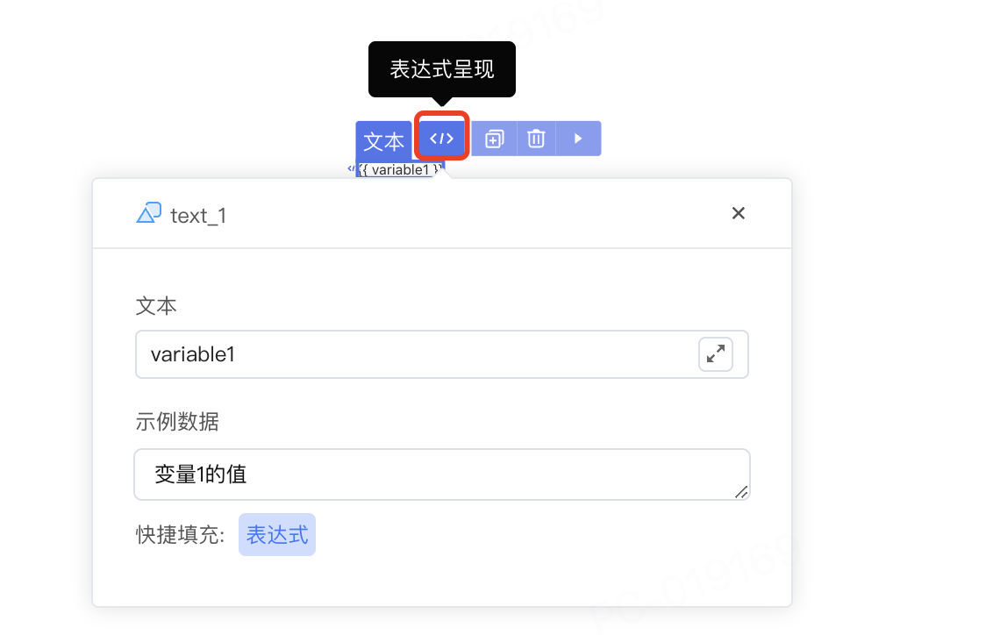
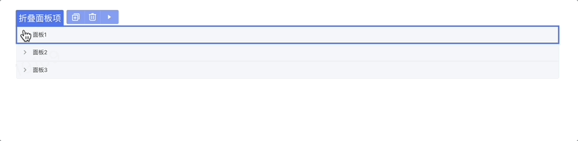
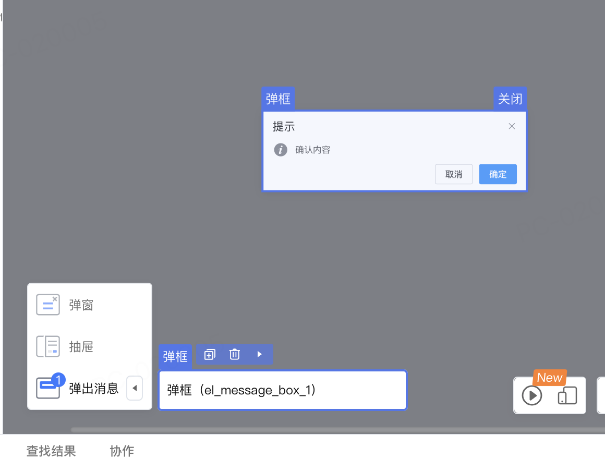

# element 配置说明

类型为 "element" 的组件无法插入子组件，是不可再分的原子组件。

```typescript
@ExtensionComponent({
  ideusage: {
    "idetype"idetype: "element"
  }
}）
```

下文以 vue 模板为例，展示配置和翻译器生层代码的匹配关系。React 相似。

## 示例

以 CloudUI 的**文本组**件 [u-text](https://github.com/netease-lcap/ui-libraries/blob/test-v3.10.x/libraries/pc-ui/src/components/u-text.vue/index.js) 为例：u-text 具有 props 属性，其具体形式为 { text: string } 。

参考配置要求：

- 将该组件归类为 element 类型的组件；
- 可以通过双击编辑 text 字段；
- text 字段支持在示例文本和表达式之间切换。

参考配置书写：

```typescript
@ExtensionComponent({
    ideusage: {
        "idetype": "element",
        "editable": "text",
        "textholder": "text",
        "useFxOrEg":{"property": "text"}
    }
})
```

这段配置会生成的vue模板如下：

```html
<u-text data-nodepath="6ac1466240c84a3cbf0f45b5da7c93a4" 
    text="普通文本" 
    key="component-6ac1466240c84a3cbf0f45b5da7c93a4" 
    data-editable="true" >
</u-text>
```

通过该模板生成html节点如下：

```html
<span vusion-slot-name-edit="text" 
    class="u-text__yjhV4gf0" 
    data-nodepath="6ac1466240c84a3cbf0f45b5da7c93a4" 
    data-editable="true">普通文本</span>
```

需要注意的点：

- 组件内需要将 data-\* 的属性透传到生成的DOM节点上
- 组件插槽需要支持设计器内置的 EmptySlot 组件和普通html dom元素

## 配置项说明

### editable

选配，定义可被编辑的属性。书写格式为`"editable": "可被编辑的属性名"`，例如：

```typescript
"editable": "text"
```

> 示例中的 text 属性来源于 api.ts 中的属性描述，实现属性描述请参考[组件配置编写说明​](../api.md)。

### textholder

选配，定义显示文本的属性。书写格式为`"textholder": "显示文本的属性名"`，例如：

```typescript
"textholder": "text"
```

> 示例中的 text 属性来源于 api.ts 中的属性描述，实现属性描述请参考[组件配置编写说明​](../api.md)。

### translateBindingProperty

选配，定义可以显示绑定变量的属性。书写格式为 `"translateBindingProperty": Array[String]`，Array\[String]即属性名的数组。

**示例**

以 CloudUI 的**选择器**组件 [u-select](https://github.com/netease-lcap/ui-libraries/blob/test-v3.10.x/libraries/pc-ui/src/components/u-select.vue/index.js) 为例。

```typescript
@ExtensionComponent({
    ideusage: {
            "idetype": "container",
            "structured": true,
            "childAccept": "['u-select-item', 'u-select-group', 'u-select-divider'].includes(target.tag)",
            "events": {
                "click": true
            },
            "translateBindingProperty": ["value", "placeholder"]
        }
})
```

此处 translateBindingProperty 定义的分别为选择器的“选中值”和“占位符”属性，属性描述如下：

```typescript
@Prop({
  title: '选中值'
})
value: USelectOptions<T, V, P, M, C>['value'];
@Prop({
  group: '主要属性',
  title: '自动获取焦点',
  description: '设置是否自动获取焦点',
  docDescription: '控制是否在进入页面时聚焦到该组件',
  designerValue: false,
  setter: {
    concept: 'SwitchSetter'
  }
})
placeholder: nasl.core.String = '请选择';
```

**IDE 中的效果**

在IDE中，若为“占位符”属性 placeholder 绑定变量，则该属性允许传入平台内置的相关属性字符串。




拖拽生成组件后，在页面设计器中生成的代码如下：

```html
<u-select data-nodepath="29d12b2924dc4217ae60dceb991e38a6" 
    data-enable-events="click" 
    :clearable="true"
    :placeholder="'{{ variable1 }}'" 
    :pageSize="50" 
    :emptyValueIsNull="true" 
    textField="text" 
    valueField="value"
    class="" key="component-29d12b2924dc4217ae60dceb991e38a6">

</u-select>
```

### iconEditor

选配，定义是否支持双击组件打开icon面板并设置icon。书写格式为`"iconEditor"：Boolean`，例如：

```typescript
"iconEditor"：true
```



### parentAccept

选配，定义可以放入当前组件的父组件。书写格式为`"parentAccept"："判断表达式"`，例如要求组件只能置入到面包屑组件 u-crumb 中：

```typescript
"parentAccept": "target.tag === 'u-crumb'"
```

### additionalAttribute

选配，定义设计器内组件展示时额外传入的属性。书写格式为`”additionalAttribute“： { key: value }` 。

**示例**

要求取消 react modal 在设计器里的弹出动画：

```typescript
@ExtensionComponent({
    "ideusage": {
      "idetype": "modal",
      ...
      "additionalAttribute": {
        "transitionName": "''", 
        "maskStyle": "{{opacity: 1,animationDuration: '0s'}}"
      },
      "cacheOpenKey": "open"
    }
})
```

> 需要注意，传入的键值对将直接放入模板翻译结果，需要对 " 等特殊符号做转义。

**IDE 中的效果**

拖拽生成组件后，在页面设计器中生成的代码如下：

```html
<Modal okText="确定" cancelText="取消" 
        key="component-24445f4bd7be4acdb923d4e53c06fe58" 
        open={true} 
        transitionName=''
        maskStyle={{opacity: 1,animationDuration: '0s'}} 
        title={...} 
        footer={...}>
        ...
</Modal>
```

### useFxOrEg

选配，定义支持表达式和示例切换的属性。书写格式为`useFxOrEg: { property: String, displayAsAttr?: Boolean }` 。

- property：表示支持的属性名；
- displayAsAttr： 表示组件是否支持内部插入子元素。

例如：

```typescript
 "useFxOrEg":{"property": "text"}
```

示例中的 text 属性来源于 api.ts 中的属性描述，实现属性描述请参考[组件配置编写说明​](../api.md)。

在IDE中，若为文本属性 text 绑定变量，支持[切换显示表达式和示例数据](https://community.codewave.163.com/CommunityParent/fileIndex?filePath=20.%E5%BA%94%E7%94%A8%E5%BC%80%E5%8F%91%2F10.%E9%A1%B5%E9%9D%A2%E8%AE%BE%E8%AE%A1%2F16.%E7%A4%BA%E4%BE%8B%E6%95%B0%E6%8D%AE%EF%BC%88%E8%A1%A8%E8%BE%BE%E5%BC%8F%E5%8D%A0%E4%BD%8D%E7%AC%A6%EF%BC%89.md&version=3.13)。



### events

选配，定义页面设计器内支持的事件。书写格式为`"events"： { key: value }` 。

- key：表示事件名称，目前支持 click 或 mousedown；
- value：表示生效条件，支持 true、false以及表达式。

例如为折叠面板组件定义点击事件，支持点击后在设计器中打开和关闭折叠面板项：

```typescript
"events": {"click": true}
```



### elementSutando

选配，定义页面设计器中的替代组件，如果设计器中要展示的组件无法与原组件相同，则可以使用为设计器定制的组件作为替代。书写格式为：

```typescript
"elementSutando": {    "condition": true,
    "component": "组件名",
    "condition": "使用替代组件的条件判断表达式",     //选配
    "selector": {                               //选配
      "slot": String,
      "cssSelector": String,
}
```

**示例**

以 ElementUI 的弹框组件 [MessageBox](https://element.eleme.cn/#/zh-CN/component/message-box) 为例：只能通过element的API唤起，不是一个组件，如果要在设计器里编排，则需要写一个类似的组件作为替身。

```typescript
@ExtensionComponent({
    ideusage: {
      "idetype": "messager",
      "elementSutando": {
        "condition": true,
        "component": "ElMessageBoxDesigner",
        "selector": {
          "slot": "default",
          "cssSelector": ".el-message-box",
        },
        "useSlot": true,
      },
      "cacheOpenKey": "visible"
    }
  })
```

**IDE 中的效果**



### style

选配，针对IDE内显示的组件内部元素定义样式。书写格式为style：`Array<Object>`，Array\<Object>即样式键值对的数组。

例如，想要覆盖 van button 组件中，被IDE禁用的动画效果，可以在style中重新定义样式表：

```typescript
@ExtensionComponent({
    "ideusage": {
        "idetype": "element",
        "useFxOrEg": {
            "property": "text"
        },
        "translateBindingProperty": ["icon", "text"],
        "style": [
            {
                "selector": ".van-loading__spinner",
                "declaration": "animation-duration: 2s!important"
            },
            {
                "selector": ".van-loading__spinner *",
                "declaration": "animation-duration: 2s!important"
            }
        ]
    }
   })
```