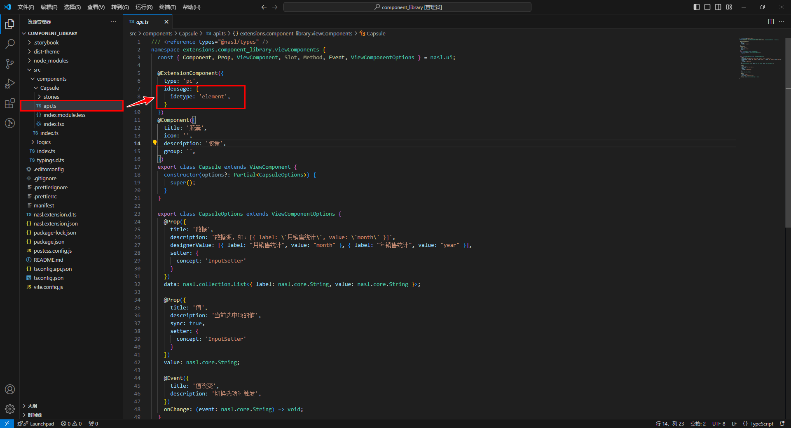
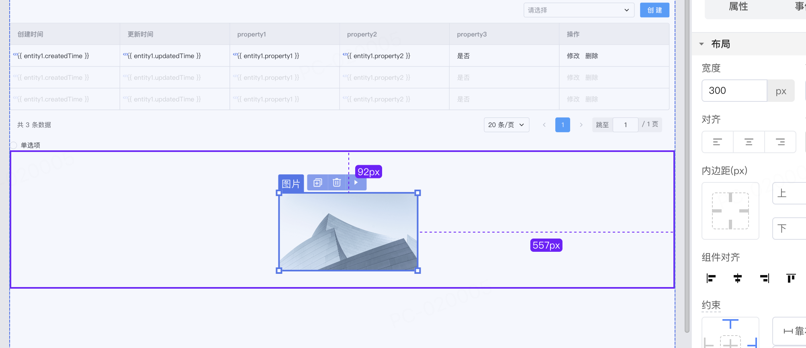

# 页面设计器适配说明

在IDE中，页面设计器是实现可视化拖拽与布局、配置属性、数据绑定、交互设计等的工具。

在依赖库项目中，开发者可以通过在 api.ts 文件中配置 ideusage ，从而定制页面设计器接入组件后内置的翻译器行为。



设计器内部的翻译结果可以通过在控制台打印预览：

通过在浏览器控制台输入 window.\_\_\$dev\_runtime\_\_ = true 来开启当前设计器内的代码输出，以便组件配置与目标代码进行比对。

## 1. 前提条件

- PC端 - IDE3.10以上版本
- H5端 - IDE3.11以上版本
- React 应用

## 2. 组件配置说明

接入的组件分为以下几种类型：

- element (默认) ：无法再插入子节点的原子组件
- container ：可以插入子节点的容器组件
- modal ：弹窗类组件
- drawer ：抽屉类组件
- messager ：消息弹出类组件
- popover ：一些弹出框类组件
- router ：路由组件
- board : 自由布局组件

开发者可以通过配置 `idetype` 来指定组件的类型，以 element 类型为例：

```typescript
@ExtensionComponent({
  ideusage: {
    idetype: "element"
  }
}）
```

### 公用配置

开发者可以为组件指定的公用配置如下：

#### forceRefresh

选配，定义组件在画布内移动后，强制刷新自己或者父组件。书写格式为：`"forceRefresh: "self"` 或 `"forceRefresh:"parent"` 。

forceRefresh 是通过key值变化强制刷新页面上的组件，比如在数据表格 table-view 中，表格列 table-view-column 的顺序需要通过强制刷新 table-view 来改变。

table-view-column的配置为：

```typescript
 "ideusage": {
        "idetype": "container",
        "forceRefresh": "parent",
        ...
 }
```

#### forceUpdateWhenAttributeChange

选配，定义组件改变属性后是否强制刷新自己。书写格式为`"forceUpdateWhenAttributeChange": Boolean` 。

forceUpdateWhenAttributeChange 同样是通过key值变化强制刷新页面上的组件。

#### ignoreProperty

选配，定义不需要翻译的属性。书写格式为`"ignoreProperty": Array[String]`，Array\[String]即属性名的数组。

例如在表单组件的表单项上，为了避免在设计器里使用到验证规则导致报错，所以屏蔽了验证规则属性 rules 的翻译：

```typescript
 "ignoreProperty": ["rules"]
```

#### useWrapperInBoard

选配，定义自由布局内是否使用div包裹。书写格式为`"useWrapperInBoard":Boolean`。

#### defaultStyleInBoard

选配，定义组件首次置入自由布局的样式。书写格式为`"defaultStyleInBoard"：Object`，Object为样式的键值对。

例如图片组件首次拖入自由布局时的宽度为300px。

```typescript
 defaultStyleInBoard: {
    width: "300px"
  }
```



### 组件配置

具体组件配置说明请前往相应的文档查看：

- [element 配置](../ide/element.md)
- [container 配置说明](../ide/container.md)
- [modal | drawer | messager 配置说明](../ide/modal.md)
- [popover 配置说明](../ide/popover.md)

### API表达式说明

配置项中使用表达式说明请参考[表达式API说明与示例](../ide/expression.md)。


