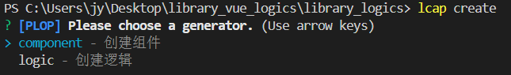
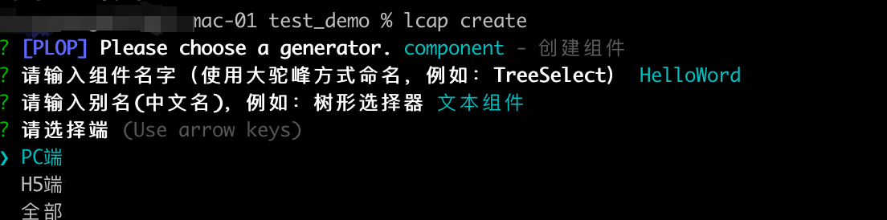
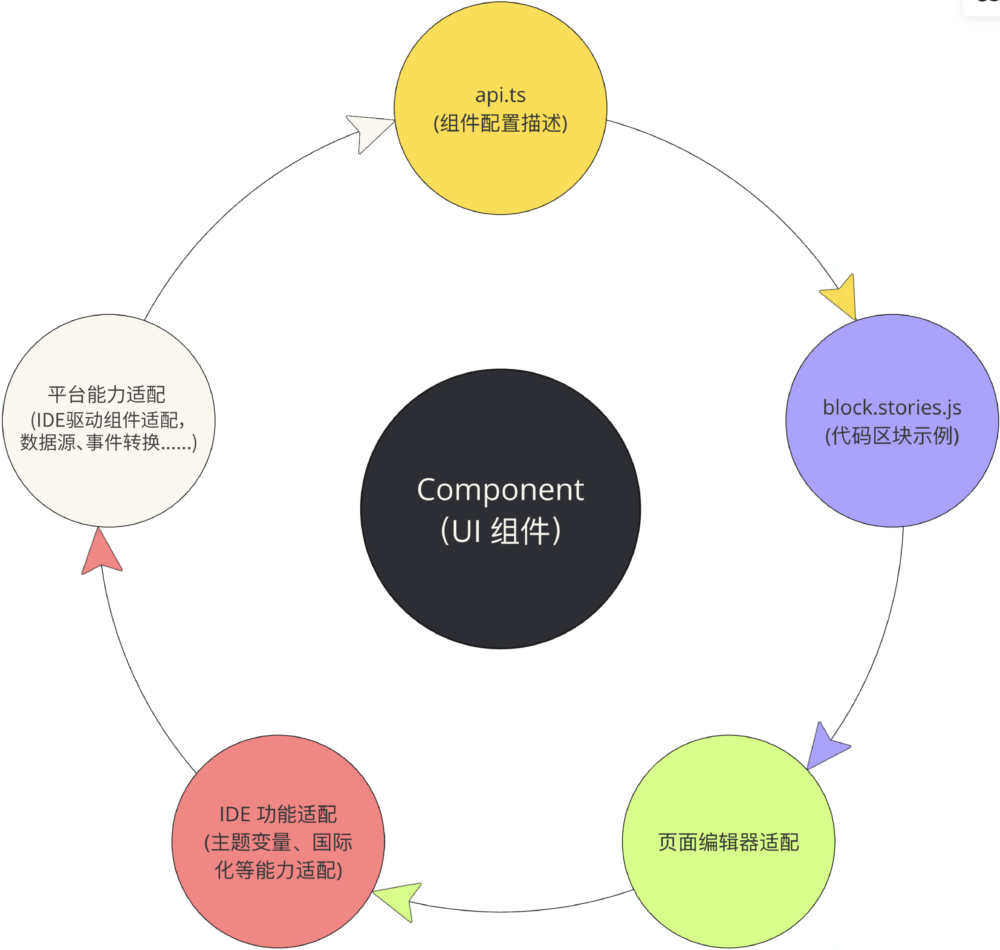

<script setup>
import { VTCodeGroup, VTCodeGroupTab } from '../../.vitepress/components'
</script>

# 组件开发指南

## 1. 初始化组件

在[创建依赖库](../get-started/init.md)之后, 执行 `lcap create` 命令可选择创建组件：



创建组件时，需要设置组件名称（组件使⽤大驼峰的格式命名，如CapsuleSelect），组件别名以及组件的适用终端，默认选择为PC端。如下：



### 组件目录

<VTCodeGroup>
  <VTCodeGroupTab label="Vue2">

  注：IDE版本>=3.8
  ```
  |- components
  |-- cwd-capsule-switch                         # 组件名称
  |---- stories
  |------ block.stories.js                       # 运行示例，必需
  |------ examples.stories.js                    # 调试demo
  |---- api.ts                                   # 组件描述文件
  |---- index.vue                                # 组件实现代码
  |---- index.ts                                 # 组件导出文件
  |---- index.module.css                         # 组件样式目录
  ```

  </VTCodeGroupTab>
  <VTCodeGroupTab label="React">

  注：IDE版本>=3.8
  ```
  |- components
  |-- CapsuleSwitch                               # 组件名称
  |---- stories                                   # 调试demo 目录
  |------ block.stories.tsx                       # 运行示例，必需
  |------ examples.stories.tsx                    # 调试demo
  |---- api.ts
  |---- index.tsx                                 # 组件目录
  |---- index.module.css                          # 组件样式目录
  ```

  </VTCodeGroupTab>
</VTCodeGroup>

## 2. 开发说明

开发需要完成的内容如下图：



- \[必要配置] [api.ts](../component/api.md)：组件配置说明， 描述用户组件的配置面板生成，应用翻译等。
- \[必要配置] [block.stories.{js|tsx|jsx}](../component/block.md)：组件拖转到画布后初始生成的代码示例。
- \[必要配置] [页面编辑器适配](../component/ide.md)：IDE 页面编辑画布适配，用于在页面上的展示。
- \[可选配置] IDE 功能适配 ：主题配置、国际化能力等扩展能力适配。
- \[可选配置] 平台能力适配 ：对平台提供能力的适配。


<style>
 .highlight {
      border: 1px solid #679CF8; /* 添加边框 */
      border-radius: 6px;
      background-color: #F8FCFF; /* 添加底色 */
      padding: 10px 20px 10px 20px;
      margin-bottom:20px;
      margin-top:20px;
      box-shadow: 0 2px 4px rgba(0, 0, 0, 0.2);
  }
</style>