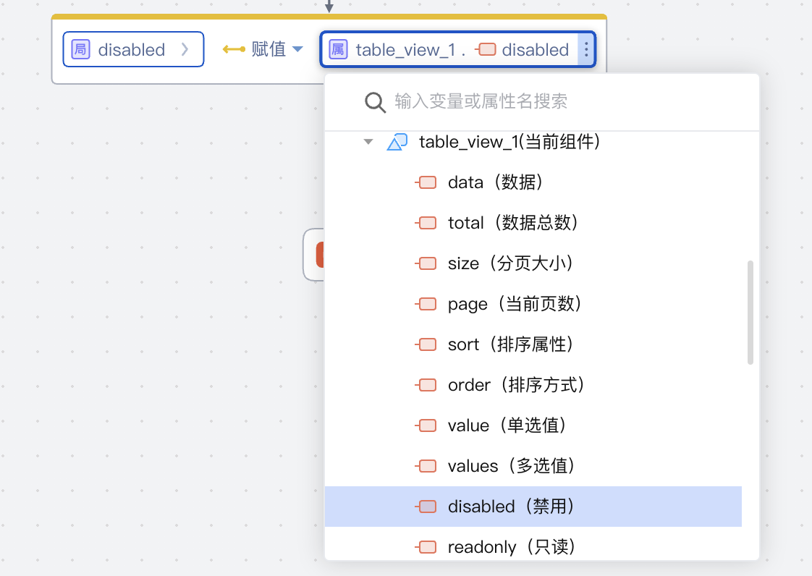
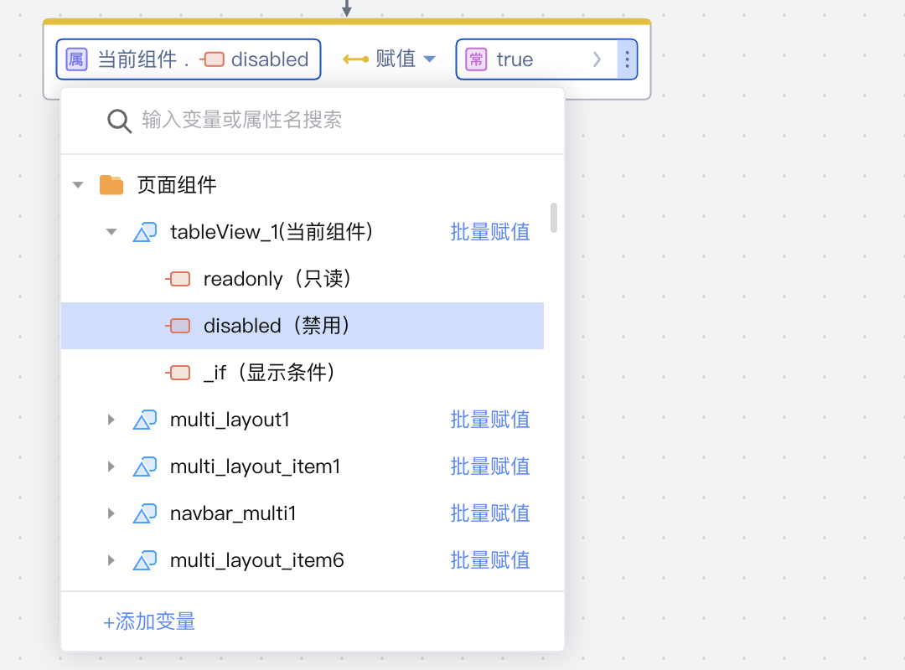

# 可访问性属性 <Badge type="tip" text="^3.9.0" />


组件的[可访问属性](https://community.codewave.163.com/CommunityParent/fileIndex?filePath=20.%E5%BA%94%E7%94%A8%E5%BC%80%E5%8F%91%2F10.%E9%A1%B5%E9%9D%A2%E8%AE%BE%E8%AE%A1%2F19.%E7%BB%84%E4%BB%B6%E5%8F%AF%E8%AE%BF%E9%97%AE%E5%B1%9E%E6%80%A7.md&version=3.13)是指在逻辑或表达式的可视化编辑面板中能够直接被访问和操作的组件属性。

在设计组件的可访问属性时，需定义可访问属性的能力，主要包括以下两个方面：

- [设置组件属性状态支持同步](#设置组件属性状态支持同步)；\[必要]
- [设置组件属性状态支持赋值](#设置组件属性状态支持赋值)。\[选配]

当前该功能仅支持在 Vue框架使用。

## 设置组件属性状态支持同步

### 1. 功能说明

支持将组件状态同步到定义的可访问属性，由可访问属性传递组件的状态。

例如在事件逻辑中将数据表格的可访问属性disabled（禁用）赋值给局部变量，即通过可访问属性disabled（禁用）使局部变量获取到组件的禁用状态。



### 2. 功能实现

1.  在 api.ts文件中增加可读属性配置。例如“值”、“禁用”、“只读”属性。

    ```typescript
    export class UTabs<T, V> extends ViewComponent {
    @Prop({
        title: '值',
    })
    value: V;

    @Prop({
        title: '禁用',
    })
    disabled: nasl.core.Boolean;

    @Prop({
        title: '只读',
    })
    readonly: nasl.core.Boolean;

    //...
    }
    ```

1.  通过组件同步sync\:state事件来同步内部状态。

    ```typescript
    // sync mixin
    import type { ComponentOptions, WatchOptionsWithHandler } from 'vue';

    export type SyncOption = string | { [name: string]: string | (() => any) };
    export interface SyncOptionItem {
    name: string;
    stateKey: string;
    computed?: () => any;
    }

    function createWatch(name: string): WatchOptionsWithHandler<any> {
    return {
        handler(val, oldVal) {
        if (val === oldVal) {
            return;
        }

        this.$emit('sync:state', name, val);
        },
        immediate: true,
    };
    }

    function normalizeSyncOptions(options: SyncOption[]) {
    const syncMap: { [key: string]: SyncOptionItem } = {};
    const computedMap: { [key: string]: () => any } = {};
    const watchMap: Record<string, WatchOptionsWithHandler<any>> = {};

    options.forEach((option) => {
        if (typeof option === 'string') {
        syncMap[option] = {
            name: option,
            stateKey: option,
        };

        watchMap[option] = createWatch(option);
        return;
        }

        Object.keys(option).forEach((name) => {
        const val = option[name];

        if (typeof val === 'function') {
            const stateKey = [name, 'sync'].join('__');
            syncMap[name] = {
            name,
            stateKey,
            };

            watchMap[stateKey] = createWatch(name);
            computedMap[stateKey] = val;
            return;
        }

        syncMap[name] = {
            name,
            stateKey: val,
        };
        watchMap[val] = createWatch(name);
        });
    });

    return {
        syncMap,
        computedMap,
        watchMap,
    };
    }

    export default (...options: SyncOption[]) => {
    const {
        syncMap,
        watchMap,
        computedMap,
    } = normalizeSyncOptions(options);
    return {
        watch: {
        ...watchMap,
        },
        computed: {
        ...computedMap,
        },
    } as ComponentOptions<any>;
    };
    ```

    ```javascript
    import sync from './sync';
    // u-tabs.vue
    export default {
    mixins: [
        sync({
        value() {
            const itemVM = this.selectedVM;
            if (!itemVM) {
            return this.value;
            }

            if (this.dataSource !== undefined) {
            return this.$at(itemVM, this.valueField);
            }

            return itemVM.value;
        },
        readonly: 'readonly',
        disabled: 'disabled',
        }),
    ],
    }
    ```

## 设置组件属性状态支持赋值

### 1. 功能说明

支持为可访问属性赋值。

例如在事件逻辑中将数据表格设置为禁用，即数据表格的可访问属性disabled（禁用）赋值为true。



### 2. 功能实现

在 api.ts文件中通过为相关属性设置`settable: true`即可开启属性可赋值。

```typescript
@Prop({
  //...
  settable: true,
})
```