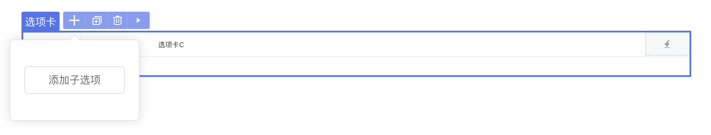
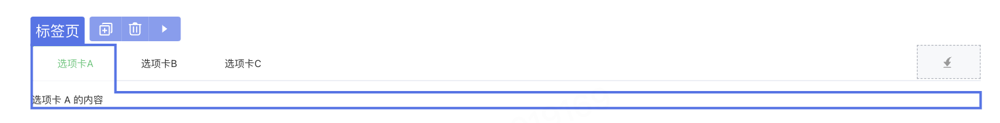

# 父组件和子组件

## 1. 功能说明

子组件在 IDE 中不会显示在右侧组件面板上，只能通过父组件 **+** 按钮添加。

以 Tabs 选项卡组件为例：通过选项卡的 ***+*** -> **添加子选项** 可为父组件选项卡添加子组件标签页。





## 2. 功能实现

### 2.1 父组件插槽配置snippets

在 api.ts 文件中定义组件。

- 父组件与子组件需要写在一个api.ts文件内，先写父组件，后写子组件。
- 子组件示例（snippets.code）书写规范可参考[区块示例说明](../block.md)template写法。


```typescript
// api.ts

@Component({
  title: '选项卡',
  description: '选项卡切换组件，常用于平级区域大块内容的收纳和展现。',
})
export class UTabs extends ViewComponent {
  // ...
  constructor(options?: Partial<TabsOptions>) { super(); }
}

export class UTabsOptions extends ViewComponentOptions {
  // ...

  @Slot({
      title: '默认',
      description: '插入`<u-tab>`子组件。',
      emptyBackground: 'add-sub', // 未添加子组件时背景显示配置
      snippets: [ // 配置插入代码示例， 插入代码规则与区块示例一致
          {
            title: '子选项',
            code: '<u-tab><template #title><u-text text="标签页"></u-text></template>内容</u-tab>',
          },
      ],
  })
  slotDefault: () => Array<UTab>;
}

@Component({
  title: '子选项',
  description: '子选项',
})
export class UTab extends ViewComponent {
  // ...
  constructor(options?: Partial<UTabOptions>) { super(); }
}

export class UTabOptions extends ViewComponentOptions {
  // ...
}
```

### 2.2 页面编辑器适配

在 api.ts 文件中配置 ideusage 将组件接入设计器。

```typescript
@ExtensionComponent({
  ideusage: {
    idetype: 'container',       // 父组件需要支持插槽
    structured: true,           // 设置为 true 才会出现 ”+“ 按钮
    childAccept: "target.tag === 'u-tab'", // 限制子组件为 u-tab
  }
})
```
