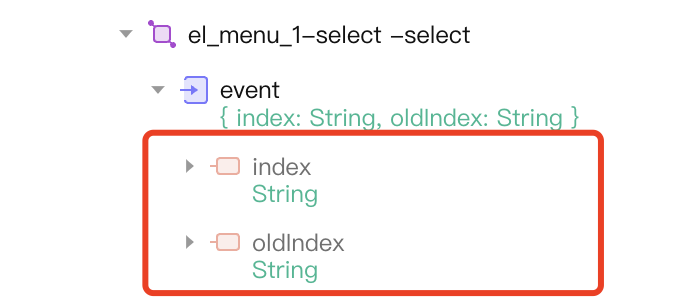

<script setup>
import { VTCodeGroup, VTCodeGroupTab } from '../../../.vitepress/components'
</script>


# 事件转换

## 1. 功能说明

平台事件触发仅支持一个 event 对象，需要将事件的参数合并到 event 对象下。



## 2. 注意事项

使用`@Event`来标注支持的事件，需要注意以下几点：

1.  事件名需要以on 开头的小驼峰，例如click 需要写为onClick，row-click需要写为onRowClick；
2.  事件参数仅允许有一个参数event，多个参数的情况需要转为一个匿名结构对象, 例如onSelect(value, item)需要转换为 onSelect({ value, item })；
3.  返回参数统一为void，匿名数据结构属性也必须使用 nasl 支持的类型；

## 3. 功能实现

<VTCodeGroup>
  <VTCodeGroupTab label="Vue2">

  参考[Element UI 导航菜单](https://element.eleme.cn/#/zh-CN/component/menu#menu-events)组件的select，open，close事件示例。

  | 事件名称   | 说明       | 回调参数                  |
  | :----- | :------- | :-------------------- |
  | select | 菜单激活回调   | index: 选中菜单项的 index,  |
  | open   | 菜单项展开的回调 | index: 打开的菜单项的 index， |
  | close  | 菜单项收起的回调 | index: 收起的菜单项的 index， |

  1.  定义触发事件的处理方法。

      ```vue
      <template>
      <el-menu  @select="handleSelect" @open="handleOpen" @close="handleClose">
      <!-- ... -->
      </el-menu>
      </template>
      <script>
      export default {
      // ...
      methods: {
          handleSelect(index, indexPath) {
          this.$emit('select', {
              index,
              indexPath,
          });
          },
          handleOpen(index, indexPath) {
          this.$emit('open', {
              index,
              indexPath,
          });
          }
          handleClose(index, indexPath) {
          this.$emit('close', {
              index,
              indexPath,
          });
          }
      }
      }
      </script>
      ```

  2.  向 api.ts 文件中写入相关事件。

      ```typescript
      // api.ts
      @Event({
      title: '菜单激活时',
      description: '菜单激活回调',
      })
      onSelect: (event: {
      index: nasl.core.String;
      indexPath: nasl.core.String;
      }) => void;

      @Event({
      title: '子菜单展开时',
      description: '子菜单展开的回调',
      })
      onOpen: (event: {
      index: nasl.core.String;
      indexPath: nasl.core.String;
      }) => void;

      @Event({
      title: '子菜单收起时',
      description: '子菜单收起的回调',
      })
      onClose: (event: {
      index: nasl.core.String;
      indexPath: nasl.core.String;
      }) => void;
      ```

  </VTCodeGroupTab>
  <VTCodeGroupTab label="React">

  参考[Ant Design 分页](https://ant-design.antgroup.com/components/pagination-cn#api)组件的onChange，onShowSizeChange事件示例。

  | 事件名称             | 说明           | 回调参数            |
  | :--------------- | :----------- | :-------------- |
  | onChange         | 页码或每页条数改变的回调 | page：改变后的页码     |
  | onShowSizeChange | 每页条数改变的回调    | current：当前状态或对象 |

  1.  定义触发事件的处理方法。

      ```typescript
      import React from 'react';
      import { Pagination } from 'antd';

      export const CwPagination = ({ onChange = () => {}, onShowSizeChange = () => {}, ...rest }) => {
      const handleChange = (page, pageSize) => {
          onChange({
          page,
          pageSize,
          });
      }

      const handleShowSizeChange = (current, size) => {
          onChange({
          current,
          size,
          });
      }

      return (
          <Pagination
          {...rest}
          onChange={handleChange}
          onShowSizeChange={handleShowSizeChange}
          />
      )
      }
      ```

  1.  向 api.ts 文件中写入相关事件。

      ```typescript
      // api.ts
      @Event({
      title: '切换分页后',
      description: '切换分页后',
      })
      onChange: (event: {
      page: nasl.core.Integer;
      pageSize: nasl.core.Integer;
      }) => void;

      @Event({
      title: '分页大小改变时',
      description: 'pageSize变化的回调',
      })
      onShowSizeChange: (event: {
      current: nasl.core.Integer;
      size: nasl.core.Integer;
      }) => void;
      ```

  </VTCodeGroupTab>
</VTCodeGroup>
