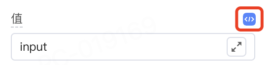
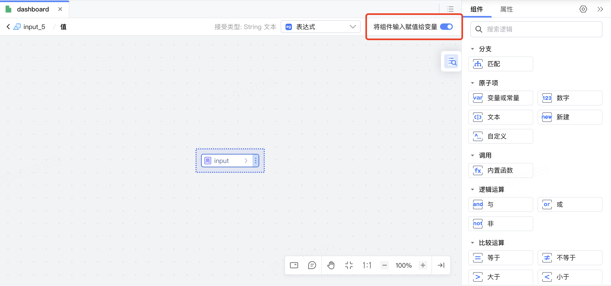
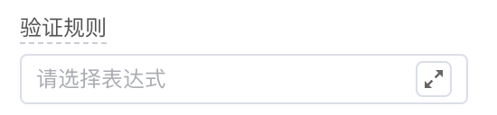

<script setup>
import { VTCodeGroup, VTCodeGroupTab } from '../../../.vitepress/components'
</script>

# 表单组件的能力适配

在设计表单类组件时，需确保组件具备作为表单项的能力，主要包括以下两个方面：

- [组件的值能够实现双向绑定](#值双向绑定处理​)；
- [组件的值可以进行校验](#验证规则设置器对接)。


## 值双向绑定处理
### 1. 功能说明

平台需要组件支持值同步到绑定变量的能力，用于传递表单项中输入、选择的值。


以单行输入组件为例，功能效果参考如下：

1.  在IDE中，单行输入的“值”属性对应输入框中的内容，该数据支持编辑表达式。

    

1.  编辑表达式时，若绑定变量，支持开启“将组件输入赋值给变量”。开启“将组件输入赋值给变量”后即表示支持值同步到绑定变量。

    

1.  发布应用后，在制品中向输入框中输入内容，该输入内容即同步存储到绑定变量中。

### 2. 功能实现

1.  目前 Vue2 通过.sync修饰符来支持绑定同步，社区组件很多只适配了 v-model，需要组件内部对外抛出 \$emit('update\:value')事件。

    ```typescript
    <template>
    <el-input v-bind="$attrs" :value="value" @input="handleInput" />
    </template>
    <script>
    export default {
    props: {
        value: String,
    },
    methods: {
        handleInput(val) {
        this.$emit('update:value', val);
        this.$emit('input', val);
        },
    }
    }
    </script>
    ```

    <div class="highlight">

    React 会自动监听onChange事件来更新绑定变量。

    </div>
    

1.  在 api.ts 文件中为相关属性设置sync: true即为允许同步。

    ```typescript
    @Prop({
    group: '数据属性',
    title: '值',
    sync: true, // 开启值同步
    })
    value: V;
    ```

## 验证规则设置器对接

### 1. 功能说明

当组件作为表单项时，通过属性对接验证规则设置器，用于设置表单项的验证规则。



### 2. 功能实现

1.  向 api.ts 文件中写入对接验证规则设置器的属性。api.ts中默认识别rules后开启验证规则设置器。

    ```typescript
    @Prop({
      group: '主要属性',
      title: '验证规则',
      description: '表单字段校验规则。',
      setter: { concept: 'InputSetter' },
      bindHide: true,
    })
    rules: nasl.core.String;
    ```

2.  需要使用@lcap/validator在组件内来实现验证功能。

    <VTCodeGroup>
      <VTCodeGroupTab label="Vue2">

      参考[Element UI Form](https://element.eleme.cn/#/zh-CN/component/form)对接平台验证能力示例。

      ```html
      <template>
      <el-form-item v-bind="$attrs" :rules="formRules">
        <slot></slot>
      </el-form-item>
      </template>
      <script>
      import VusionValidator, { localizeRules } from '@lcap/validator';

      export default {
        props: {
          rules: {
            type: Array,
            default: () => [],
          },
        },
        computed: {
          formRules() {
            return this.rules.map((item) => {
              return {
                trigger: 'change',
                validator: (r, val, callback) => { // 自定义验证规则
                  const validator = new VusionValidator(undefined, localizeRules, [item]);
                  validator.validate(val).then(() => {
                    callback();
                  }).catch((errorMessage) => {
                    callback(new Error(errorMessage));
                  });
                },
              },
            })
          }
        }
      };
      </script>
      ```
      </VTCodeGroupTab>
      <VTCodeGroupTab label="React">

      参考[Ant Design Form](https://ant-design.antgroup.com/components/form-cn)对接平台验证能力示例。

      ```typescript
      import React from 'react';
      import { Form } from 'antd';
      import VusionValidator, { localizeRules } from '@lcap/validator';

      const useFormRules = (rules = []) => {
        return React.useMemo(() => {
          return ruls.map((item) => {
            return {
              message: item.message,
              required: item.required,
              validateTrigger: ['onChange', 'onBlur'],
              ...item,
              validator: (rule, value) => {
                const validator = new VusionValidator(undefined, localizeRules, [rule]);
                return validator.validate(value);
              },
            };
          });
        }, [rules]);
      };

      export const FormItem = ({ rules = [], ...rest }) => {
        return (
          <Form.Item
            {...rest}
            rules={useFormRules(rules)}
          />
        );
      }
      ```
      </VTCodeGroupTab>
    </VTCodeGroup>

<style>
 .highlight {
      border: 1px solid #679CF8; /* 添加边框 */
      border-radius: 6px;
      background-color: #F8FCFF; /* 添加底色 */
      padding: 10px 20px 10px 20px;
      margin-bottom:20px;
      margin-top:20px;
      box-shadow: 0 2px 4px rgba(0, 0, 0, 0.2);
  }
</style>