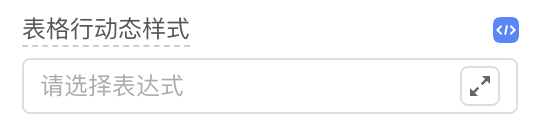
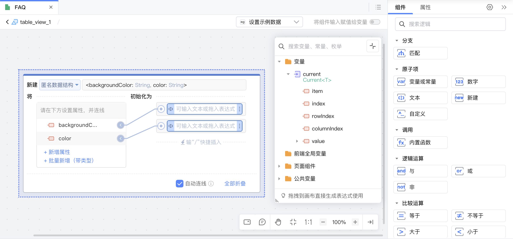
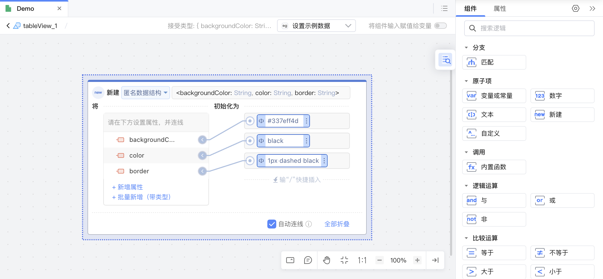
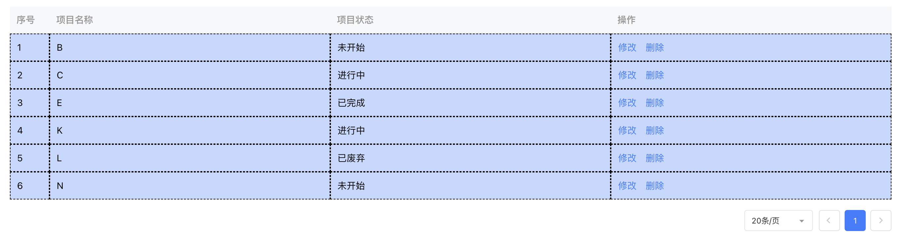

# 函数设置器 <Badge type="tip" text="^3.10.0" />

## 1. 功能说明

用于Function类型的函数设置 (AnonymousFunctionSetter)，例如： 表格行样式、文本格式化、日期格式化函数等等...

以下以数据表格组件的“表格行动态样式”属性为例：



## 2. 功能实现

向 api.ts 文件中写入“表格行动态样式样式”属性：

- `bindOpen: true` ：表明属性的编辑表达式模式处于开启状态；
- `concept: 'AnonymousFunctionSetter'` ：表明设置器的概念是匿名函数设置器；
- `rowStyle` 是一个函数类型的属性，接收一个 Current 类型参数 current ，这个函数返回一个对象，包含两个可选的属性：


  - backgroundColor：用于设置列表行的背景颜色，类型为String。
  - color：用于设置列表行的字体颜色，类型为String。

```typescript
// api.ts
@Prop({
    group: '样式属性',
    title: '列表行动态样式',
    description: '动态设置列表项背景色、字体颜色等样式',
    docDescription: '动态设置列表项背景色、字体颜色等样式',
    bindOpen: true,
    setter: {
        concept: 'AnonymousFunctionSetter',
    }
})
rowStyle: (current: Current<T>) => { 
    /**
   - @title 列表行背景颜色
     */
    backgroundColor?: nasl.core.String, 
    /**
   - @title 列表行字体颜色
     */
    color?: nasl.core.String 
};
```

<div class="highlight">

目前仅支持同步函数，返回值不允许是Promise

</div>


## 3. 使用效果演示

- 进入编辑表达式界面时，表达式中已有包含 backgroundColor 和 color 属性的匿名数据结构，变量可选参数 current。

    

- 支持初始化表格的列表行背景颜色、列表行字体颜色，甚至新增表格已定义的其他属性。

    

制品效果如下：



<div class="highlight">

使用“表格行动态样式”属性的常见场景具体请参考[如何实现动态展示表格行样式](https://community.codewave.163.com/CommunityParent/fileIndex?filePath=80.%E5%B8%B8%E8%A7%81%E5%9C%BA%E6%99%AF%E6%A1%88%E4%BE%8B%2F80.%E4%B8%9A%E5%8A%A1%E5%9C%BA%E6%99%AF%2F145.%E5%A6%82%E4%BD%95%E5%AE%9E%E7%8E%B0%E5%8A%A8%E6%80%81%E5%B1%95%E7%A4%BA%E8%A1%A8%E6%A0%BC%E8%A1%8C%E6%A0%B7%E5%BC%8F.md&version=3.13)。

</div>


<style>
 .highlight {
      border: 1px solid #679CF8; /* 添加边框 */
      border-radius: 6px;
      background-color: #F8FCFF; /* 添加底色 */
      padding: 10px 20px 10px 20px;
      margin-bottom:20px;
      margin-top:20px;
      box-shadow: 0 2px 4px rgba(0, 0, 0, 0.2);
  }
</style>