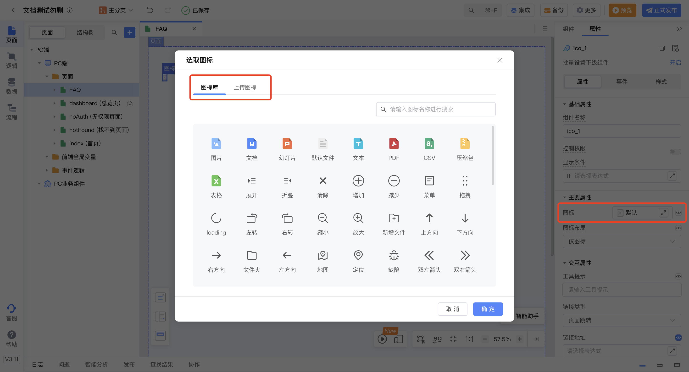
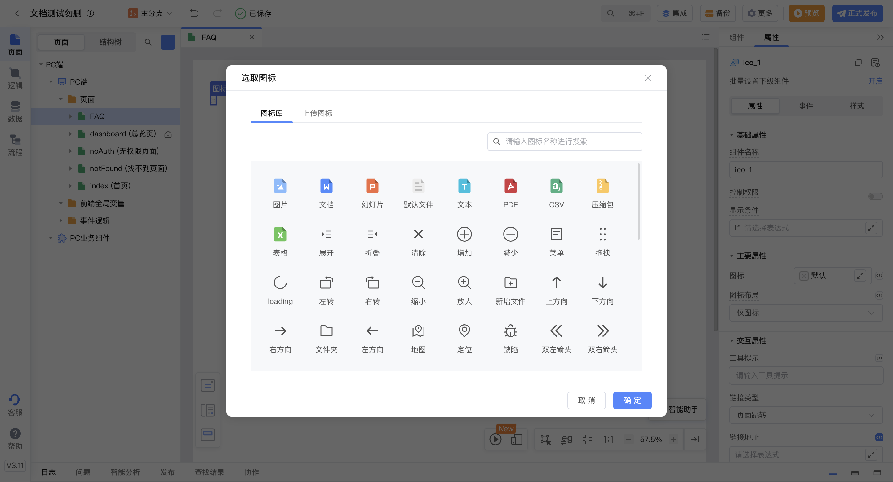
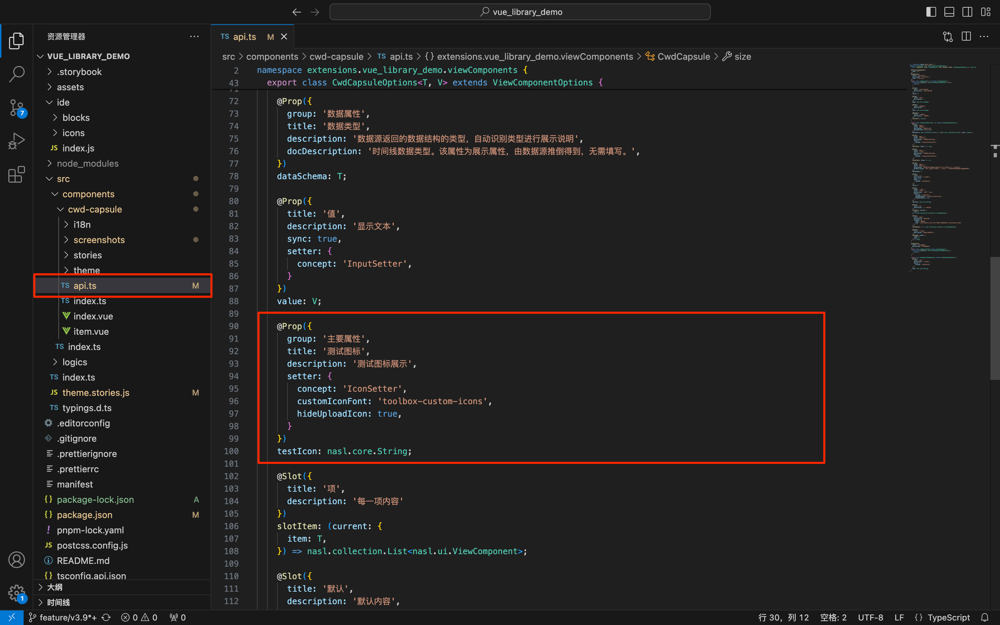
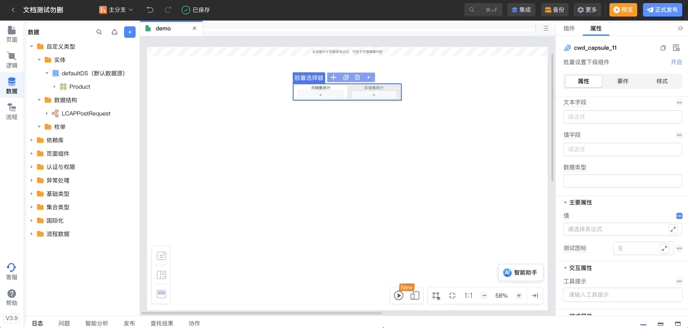
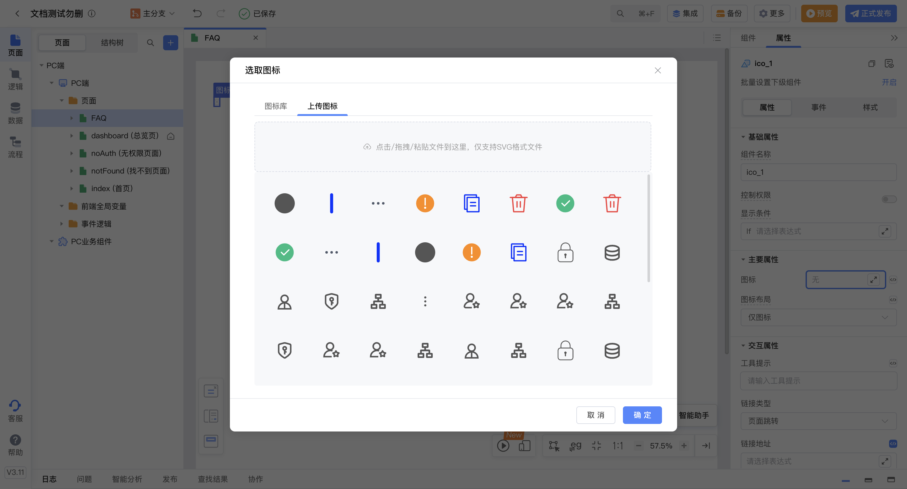

<script setup>
import { VTCodeGroup, VTCodeGroupTab } from '../../../.vitepress/components'
</script>

# 图标设置

组件图标属性的设置， 目前平台支持[从图标库选择](#支持从图标库选择)与[用户上传图标](#支持用户上传图标)两种方式，两种方式都以String类型传入属性值。



- 从图标库选择：组件接收到“图标名称“。
- 用户上传图标：组件接收到一个在线的.svg后缀的url地址。

以上两种方式均需要先向 api.ts 文件中写入用于设置图标的属性：

```typescript
@Prop({
  title: '图标',
  description: '图标',
  group: '主要属性',
  setter: {
    concept: 'IconSetter',
  },
})
prefixIcon: nasl.core.String;
```

接下来，需要在组件内容实现图标的渲染。

## 支持从图标库选择

### 1. 功能说明

组件接收到图标库中的“图标名称”后展示对应图标。



### 2. 功能实现

通过 “customIconFont” 设置使用图标库名称。

不填写会使用基础组件默认图标库， 其他还支持 LCAP\_ELEMENTUI\_ICONS （element ui 图标）、LCAP\_REMIX\_ICONS （三方remix 图标库）。

```typescript
@Prop({
  title: '图标',
  description: '图标',
  group: '主要属性',
  setter: {
    concept: 'IconSetter',
    customIconFont: '', 
  },
})
icon: nasl.core.String
```

（可选）除默认支持的图标库以外，支持**扩展图标库**后将 customIconFont 设置为扩展图标库的名称。

### 3. 扩展图标库

**功能说明**

组件属性中包含图标设置器（IconSetter）时，自定义可选择的图标库。


**操作步骤**

1.  在 ide 目录下创建 icons 相关文件。示意图如下：
    ```
    |-- ide
    |---- icons
    |-------- icon-font.js
    |-------- icon-config.json
    |-------- index.js
    |---- index.js           // ide 扩展打包入口文件
    ```

    例如：使用 [iconfont.cn](http://iconfont.cn/) 管理图标库，复制项目中的 symbol 文件和 JSON配置 到目录下。

    

1.  配置文件 ide/icons/index.js ，增加图标配置。

    ```javascript
    // 导入 iconfont.cn symbol js
    import './icon-font.js';
    // 导入 iconfont.cn  复制json
    import IconConfig from './icon-font.json';

    export default [{
        name: 'toolbox-custom-icons',
        config: IconConfig,
    }];
    ```

1.  配置文件 ide/index.js，将入口文件导出为 icons 。

    ```javascript
    export { default as icons } from './icons';
    ```

1.  找到 api.ts 文件并打开，标注图标设置器（IconSetter）使用扩展图标库。

    ```typescript
    @Prop({
    title: '图标',
    description: '图标',
    group: '主要属性',
    setter: {
        concept: 'IconSetter',
        customIconFont: 'toolbox-custom-icons', 
    },
    })
    icon: nasl.core.String
    ```

    

**使用效果演示**

以下效果为依赖库打包发布并在IDE中引入后的使用演示。



## 支持用户上传图标

### 1. 功能说明

组件接收到一个在线的.svg后缀的url地址后展示对应图标。例如：

<https://static-vusion.nos-eastchina1.126.net/h5-template/svgviewer-output.svg>。



### 2. 功能实现


<VTCodeGroup>
  <VTCodeGroupTab label="Vue2">

  推荐使用 [online-svg-icon](https://github.com/qingniao99/online-svg-icon-vue2/blob/main/src/index.vue) 组件
  ```vue
  <template>
    <online-svg-icon v-if="isOnlySvgIcon" :url="icon"  />
    <!-- 默认走内部图标组件渲染 --> 
    <xx-icon v-else :name="icon" />
  </template>
  <script>
  import OnlineSvgIcon from 'online-svg-icon-vue2';
  export default {
    components: {
      OnlineSvgIcon,
    },
    props: {
      icon: string,
    },
    computed: {
      isOnlySvgIcon() {
        return this.icon && this.icon.indexOf('/') !== -1 && /\.svg/i.test(this.icon)
      },
    }
  }
  </script>
  ```

  </VTCodeGroupTab>
  <VTCodeGroupTab label="React">

  ```jsx
  const OnlineSvgIcon = ({ icon }) => {
    return (
      
    );
  };
  ```

  </VTCodeGroupTab>
</VTCodeGroup>