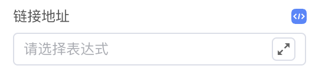
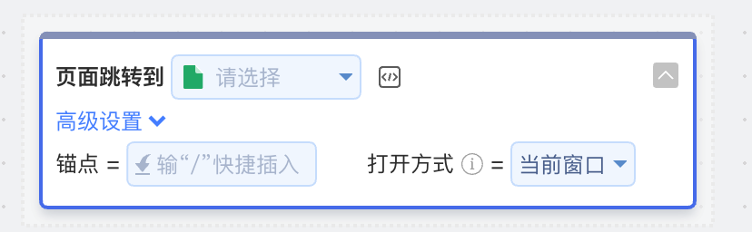

<script setup>
import { VTCodeGroup, VTCodeGroupTab } from '../../../.vitepress/components'
</script>

# 链接跳转

## 1. 功能说明

为了便于CodeWave开发者配置，平台对链接跳转功能做了优化。



配置页面跳转的“链接地址”属性时，支持通过“链接设置器”设置需要跳转的页面。跳转的页面支持直接选择应用内页面，也支持将链接地址作为“页面跳转到”编辑表达式的输出结果。



## 2. 功能实现

### 2.1 增加链接跳转相关属性

向 api.ts 文件中写入链接跳转相关属性。设置“链接地址”的属性无需设置setter，而使用hrefAndTo属性设置，IDE会识别该属性启用如上“链接设置器”。

```typescript
@Prop({
  group: '交互属性',
  title: '链接地址'
})
hrefAndTo: nasl.core.String;
```

### 2.2 组件内部实现跳转

平台在组件上会设置link和destination两个属性：

- link：外部链接，例如<https://codewave.163.com>
- destination：内部链接，例如 /dashboard

组件内部需要对这两个属性增加对应的代码，使组件被点击时发生页面跳转。

<VTCodeGroup>
  <VTCodeGroupTab label="Vue2">

  ```vue
  <template>
  <a :href="linkURL" :target="target" @click="handleClick">链接</a>
  </template>
  <script>
  export default {
    props: {
      link: String,
      destination: String,
      target: String,
      replace: Boolean,
    },
    computed: {
      linkURL() {
        return destination || link;
      },
    },
    methods: {
      handleClick(e) {
        this.$emit('click', e);
        
        if (!this.destination || this.target === '_blank' || !this.$router) {
          return;
        }

        // 阻止默认行为
        e.preventDefault();
        e.returnValue = false;

        // vue router 跳转
        this.routerNavigate(this.destination);
      },
      routerNavigate(url) {
        if (this.replace) {
          this.$router.replace(url);
          return;
        }
        
        this.$router.push(url);
      },
    },
  };
  </script>
  ```

  </VTCodeGroupTab>
  <VTCodeGroupTab label="React">

  ```tsx
  import React, { FC, HTMLAttributes } from 'react';
  import { useNavigate } from 'react-router-dom';

  export interface CwLinkProps extends HTMLAttributes<HTMLLinkElement> {
    link: string;
    destination: string;
    target: string;
    replace: boolean;
  }

  const CwLink: FC<CwLinkProps> = (props) => {
    const {
      link,
      destination,
      target,
      replace,
      ...rest
    } = props;

    const navigate = useNavigate();

    const handleClick = (e: Event) => {
      if (!destination || target === '_blank') {
        return;
      }

      // 阻止默认行为
      e.preventDefault();
      e.returnValue = false;

      // 此处走 react router 跳转
      navigate(destination, { replace });
    }

    return (
      <a {...rest} href={destination || link} onClick={handleClick}>链接</a>
    );
  };
  ```

  </VTCodeGroupTab>
</VTCodeGroup>