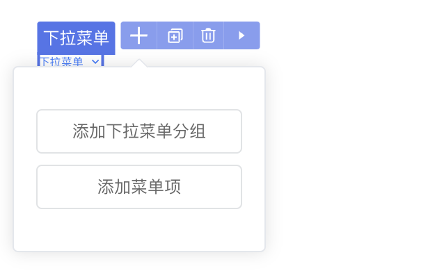

# 插槽处理

## 1. 功能说明

组件的插槽是一种用于在组件中传递内容的机制，它允许父组件向子组件传递内容，使得子组件可以更加灵活地展示不同的内容。

## 2. 功能实现

### 2.1 插槽配置

在 api.ts 文件中使用@Slot来描述组件插槽。插槽属性名以slot开头的小驼峰命名，例如：默认插槽slotDefault；具名插槽例如写为slotHeader。

以下简单描述插槽常见的处理方式：

#### 默认插槽

没有特定的名称标识，它提供了一种简单的方式让父组件向子组件传递内容，并在子组件的特定位置进行渲染。

以 Dropdown 下拉菜单组件为例：



```typescript
// 在 @Component 上增加ide 配置
@ExtensionComponent({
  // ...
  ideusage: {
    idetype: 'container',
    structured: true,           // 设置为 true 才会出现 ”+“ 按钮
  }
})
export class ElMenuOptions extends ViewComponentOptions {
  // 以Menu 为例
  // ...
  @Slot({
    title: 'Default',  // 名称
    description: '内容', // 描述
    snippets: [ // ide 编辑 “+” 点击后的提示，  title提示描述， code 点击后默认添加代码
    {
        title: '添加下拉菜单分组',
        code: '<el-menu-item-group></el-menu-item-group>',
      },
      { title: '菜单项', code: '<el-menu-item></el-menu-item>' },
    ],
  })
  slotDefault: () => Array<nasl.ui.ViewComponent>;
}
```

#### 具名插槽

允许父组件在使用子组件时，可以将不同的内容插入到子组件的特定插槽位置，并且通过名称来区分不同的插槽。

```typescript
export class XxxOptions extends ViewComponentOptions {
  // ...
  @Slot({
      title: '头部内容',
      description: '头部内容',
  })
  slotHeader: () => Array<nasl.ui.ViewComponent>;
}
```

#### 作用域插槽

允许子组件向父组件传递数据，以便父组件可以根据这些数据来渲染插槽内容。

```typescript
export class XxxOptions extends ViewComponentOptions {
  // ...
  @Slot({
      title: '循环项的插槽',
      description: '自定义选项的结构和样式',
  })
  slotItem: (current: Current<T>) => Array<nasl.ui.ViewComponent>;
}

// current 参数类型
declare namespace nasl.ui {
  export class Current<T> {
    item: T;
    index: nasl.core.Integer;
    rowIndex: nasl.core.Integer;
    columnIndex: nasl.core.Integer;
    value: nasl.core.String;
  }
}
```

- Current 为平台默认插槽参数类型，也支持自定义类型。

```typescript
slotItem: (current: {
  row: T,
  disabled: nasl.core.Boolean,
  // .... 
})
```

### 2.2 页面编辑器适配

在 api.ts 文件中配置 ideusage 将组件接入设计器。

```typescript
// 在 @Component 上增加ide 配置
@ExtensionComponent({
  // ...
  ideusage: {
    idetype: 'container',
  }
})
```

- idetype为 container的组件可以插入子节点。

<div class="highlight">

更多配置项可查看文档[页面编辑器适配说明-container配置](../ide/container.md)。

</div>


<style>
 .highlight {
      border: 1px solid #679CF8; /* 添加边框 */
      border-radius: 6px;
      background-color: #F8FCFF; /* 添加底色 */
      padding: 10px 20px 10px 20px;
      margin-bottom:20px;
      margin-top:20px;
      box-shadow: 0 2px 4px rgba(0, 0, 0, 0.2);
  }
</style>