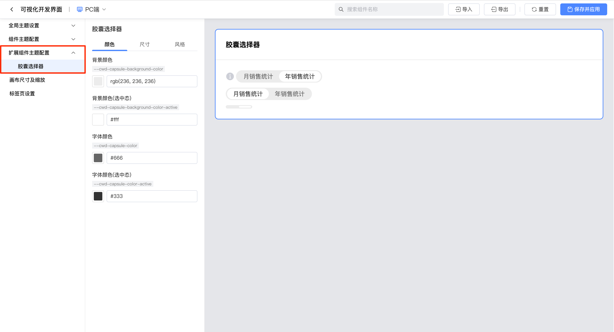
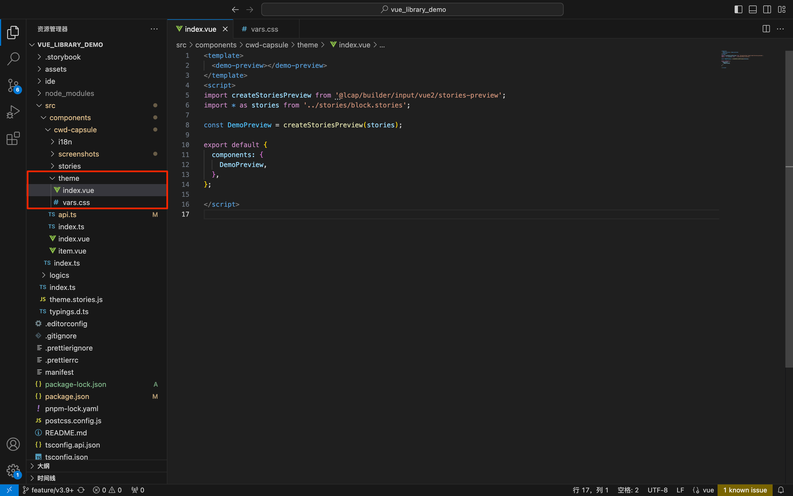
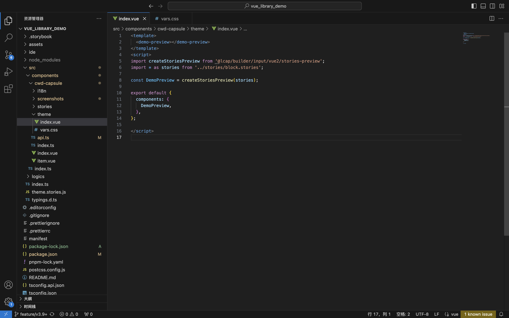
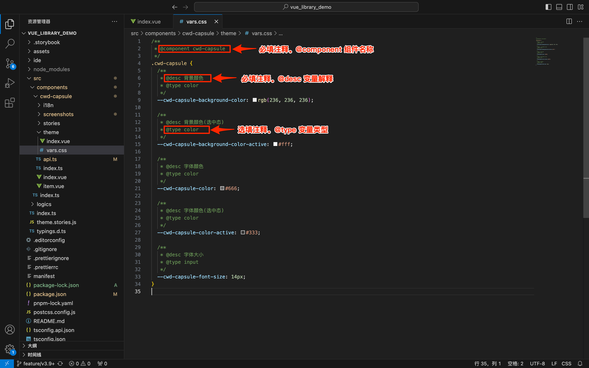
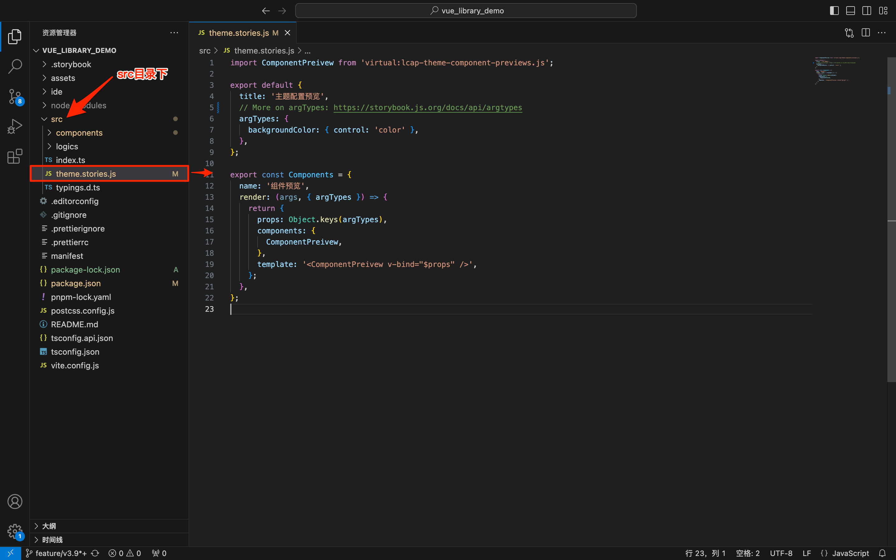
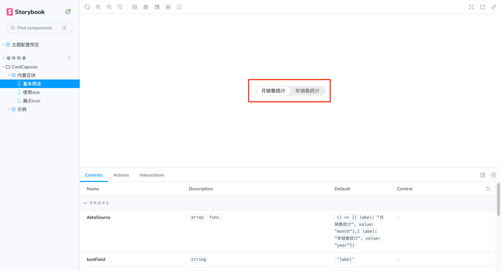

<script setup>
import { VTCodeGroup, VTCodeGroupTab } from '../../.vitepress/components'
</script>

# 主题样式配置

## 1. 功能说明

在IDE的 **更多**->**自定义主题样式** 中配置组件的默认外观，或者在 **组件属性**->**样式面板** 中设置主题样式。



## 2. 功能实现

### 2.1 创建主题文件

在组件目录下创建文件夹 theme，theme文件夹下创建文件 index.vue / index.jsx 和 vars.css 。

<VTCodeGroup>
  <VTCodeGroupTab label="Vue2">

  ```
  |-- src
  |---- components
  |------- cwd-capsule-switch
  |----------- theme              // 主题目录
  |------------- index.vue        // 组件主题预览
  |------------- vars.css         // 可配置变量
  ```

  </VTCodeGroupTab>
  <VTCodeGroupTab label="React">

  ```
  |-- src
  |---- components
  |------- CwdCapluse
  |---------- theme               // 主题目录
  |------------- index.jsx        // 组件主题预览
  |------------- vars.css         // 可配置变量
  ```

  </VTCodeGroupTab>
</VTCodeGroup>

示意图如下：



### 2.2 配置文件

1.  配置文件 index.vue / index.jsx。默认可使用组件区块实例作为主题配置预览。

    <VTCodeGroup>
      <VTCodeGroupTab label="Vue2">

      ```vue
      <!-- index.vue -->
      <template>
        <demo-preview></demo-preview>
      </template>
      <script>
      // 默认可使用组件区块实例作为主题配置预览
      import createStoriesPreview from '@lcap/builder/input/vue2/stories-preview';
      import * as stories from '../stories/block.stories';

      const DemoPreview = createStoriesPreview(stories);

      export default {
        components: {
          DemoPreview,
        },
      };
      </script>
      ```


      </VTCodeGroupTab>
      <VTCodeGroupTab label="React">

      ```typescript
      // index.jsx
      // 默认可使用组件区块实例作为主题配置预览
      import createStoriesPreview from '@lcap/builder/input/react/stories-preview';
      import * as stories from '../stories/block.stories';

      export default createStoriesPreview(stories);
      ```

      </VTCodeGroupTab>
    </VTCodeGroup>

    


2.  配置文件 vars.css 。标注支持自定义主题样式的组件以及组件样式相应的变量。

    

    <div class="highlight">

    vars.css 文件配置规范：

    - 组件主题注释

        - @component 必需，注释支持自定义主题样式的组件的组件名称，组件名称与 api.ts 中一致。
        - @hidden 非必需，表示隐藏该组件主题配置功能
    - 变量注释

        - @desc 必需，注释组件样式对应的变量
        - @type 注释变量类型，默认为 input，支持填写color、size、input。
        - @group 表示变量分组
        - @hidden 非必需，表示隐藏该变量配置功能

    </div>

    <details>
        <summary title="点击展开示例代码">
            点击展开示例代码
        </summary>

    ```css
    /**
    * @component cwd-capsule
    */
    .cwd-capsule {
    /**
    * @desc 背景颜色
    * @type color
    */
    --cwd-capsule-background-color: rgb(236, 236, 236);

    /**
    * @desc 背景颜色(选中态)
    * @type color
    */
    --cwd-capsule-background-color-active: #fff;

    /**
    * @desc 字体颜色
    * @type color
    */
    --cwd-capsule-color: #666;

    /**
    * @desc 字体颜色(选中态)
    * @type color
    */
    --cwd-capsule-color-active: #333;

    /**
    * @desc 字体大小
    * @type input
    */
    --cwd-capsule-font-size: 14px;
    }
    ```

    </details>


## 3. 本地预览调试

1.  在 src 目录下配置文件 theme.stories.js，用于本地调试主题配置预览。

    <VTCodeGroup>
    <VTCodeGroupTab label="Vue2">

    ```javascript
    import ComponentPreview from 'virtual:lcap-theme-component-previews.js';

    export default {
      title: '主题配置预览',
      // More on argTypes: https://storybook.js.org/docs/api/argtypes
      argTypes: {
        backgroundColor: { control: 'color' },
      },
    };

    export const Components = {
      name: '组件预览',
      render: (args, { argTypes }) => {
        return {
          props: Object.keys(argTypes),
          components: {
            ComponentPreview,
          },
          template: '<ComponentPreview v-bind="$props" />',
        };
      },
    };
    ```

    </VTCodeGroupTab>
    <VTCodeGroupTab label="React">

    ```javascript
    import ComponentPreview from 'virtual:lcap-theme-component-previews.js';

    export default {
      title: '主题配置预览',
      // More on argTypes: https://storybook.js.org/docs/api/argtypes
      argTypes: {
        backgroundColor: { control: 'color' },
      },
    };

    export const Components = {
      name: '组件预览',
      render: ComponentPreview,
    };
    ```

    </VTCodeGroupTab>
    </VTCodeGroup>
    
2.  打开终端运行 npm run dev 启动服务，预览默认主题配置效果。

    

## 4. 使用效果演示

npm run build之后dist-theme目录下会生成theme.config.json文件与theme/index.html预览文件。

以下效果为依赖库打包发布并在IDE中引入后的使用演示。


<style>
 .highlight {
      border: 1px solid #679CF8; /* 添加边框 */
      border-radius: 6px;
      background-color: #F8FCFF; /* 添加底色 */
      padding: 10px 20px 10px 20px;
      margin-bottom:20px;
      margin-top:20px;
      box-shadow: 0 2px 4px rgba(0, 0, 0, 0.2);
  }
 details {
      border: 1px solid #679CF8; /* 添加边框 */
      border-radius: 6px;
      background-color: #F8FCFF; /* 添加底色 */
      padding: 10px 40px 10px 40px;
      box-shadow: 0 2px 4px rgba(0, 0, 0, 0.2);
  }
 details summary {  
    margin: 0 0 0 -20px;
    font-weight: bold;
    color: #679CF8;
    cursor: pointer;
  }
</style>
