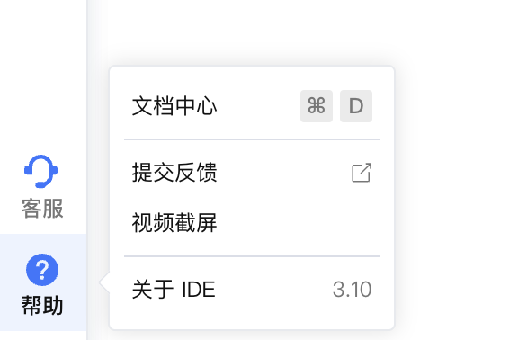
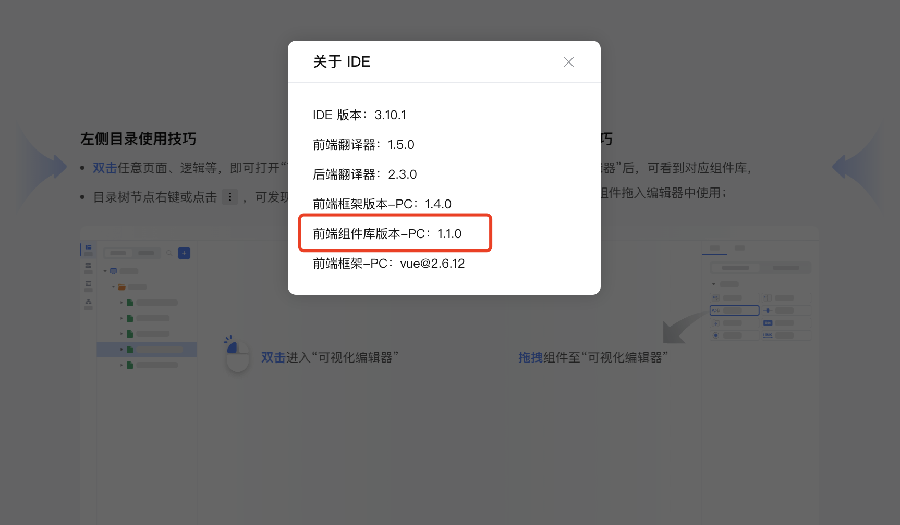
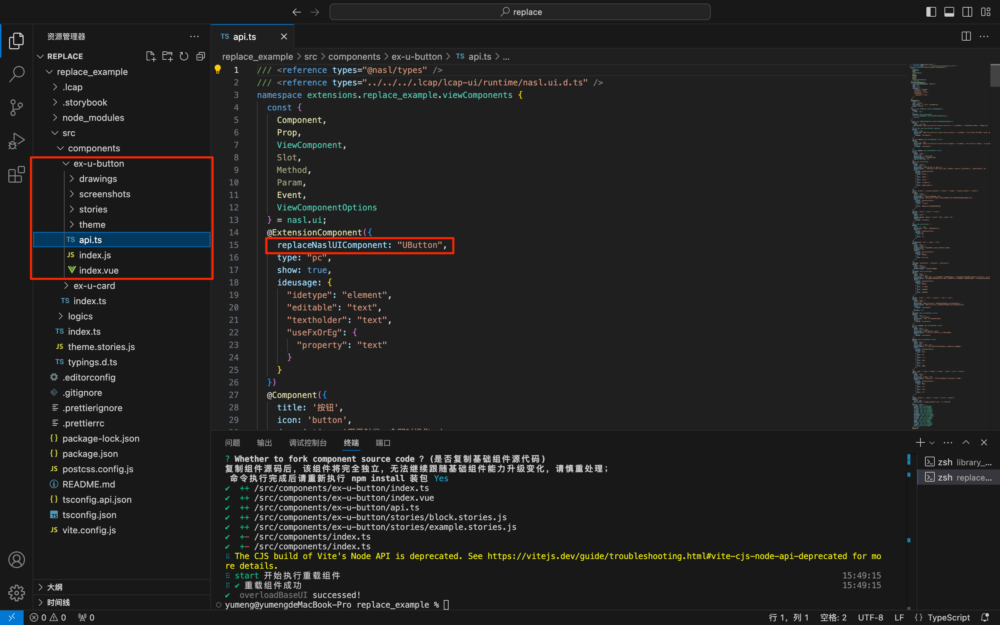
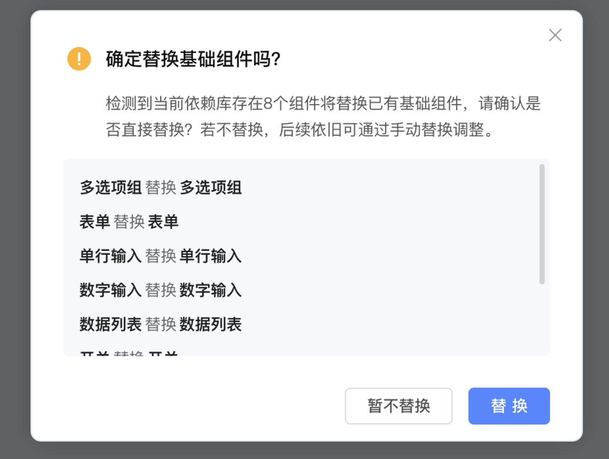
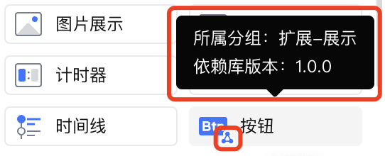

# 基础组件二次开发指南 <Badge type="tip" text="^3.10.0" />

## 1. 功能说明

在平台的实际使用中，用户可能会发现当前提供的基础组件功能尚不足以完全满足需求，或更倾向于根据个人或项目的特定需求对基础组件进行进一步的定制与扩展，即所谓的“二次开发”。

IDE从3.10.0版本开始支持使用扩展组件替换基础组件。扩展组件通过依赖库引入，以下将介绍如何使用依赖库对基础组件进行二次开发。

阅读本文之前，请先学习[前端扩展开发-快速开始](../get-started/environment.md)，熟悉依赖库开发流程及常规步骤。

## 2. 功能实现

### 2.1 初始化依赖库

#### 选择添加codewave基础组件包

1.  执行 lcap init 创建依赖库项目。

    ```
    lcap init
    ```

1.  ... 此处省略前置名称输入、选择模板等步骤。
2.  选择添加 codewave 基础组件包。

    ```
    Whether overload base component? (是否重载基础组件)
    — None (默认)
    √ Button (按钮)
    — Select (选择器)
    重载基础组件,名称仅允许增加前缀
    Please Input overload prefix? (请输入重载名称前缀，例如 ex) ex
    fork base Component Button ? (yes, no)
    Fork 组件后，完全独立，无法继续跟随基础组件能力升级变化，请慎重处理；
    ```

    <details style="margin-bottom:30px">
        <summary title="查看组件库版本">
            点击展开 如何查看组件库版本
        </summary>
    点击IDE左下角 帮助-关于IDE。

    

    
    </details>


    

#### 生成依赖库目录结构

选择添加基础组件包后，npm install 后会新增 .lcap 目录存放下载的平台依赖包。
```
|-- Button
|---- screenshots                     // 复制基础组件截图
|---- drawings                        // 复制基础组件截图
|---- stories
|------- block.stories.js             // 复制基础组件区块示例
|---- index.js
|---- api.ts                          // 复制基础组件 api.ts
```

#### 依赖库中使用基础组件

选择添加基础组件包后，依赖库中可以通过 virtual-lcap\:lcap-ui 直接调用基础组件，脚手架会自动加载对应的js模块、css代码；

```typescript
import { Button, Modal } from 'virtual-lcap:lcap-ui';
```

### 2.2 创建组件

#### 选择重载组件

1.  执行 lcap create component 创建依赖库组件。

    ```
    lcap create component
    ```

1.  选择需要二次开发的基础组件。

    ```
    Whether overload base component? (是否重载基础组件)
    — None (默认)
    √ Button (按钮)
    — Select (选择器)
    重载基础组件,名称仅允许增加前缀
    Please Input overload prefix? (请输入重载名称前缀，例如 ex) ex
    fork base Component Button ? (yes, no)
    Fork 组件后，完全独立，无法继续跟随基础组件能力升级变化，请慎重处理；
    ```
<div class="highlight">

- 选择 fork 组件会更新 package.json 需要重新安装包 npm install；
- 仅 Vue2 框架下CloudUI 或者 H5 组件库支持 fork 代码的方式对组件进行修改。

</div>


#### 生成组件目录结构

选择重载的组件后，会复制基础组件拖拽区块示例(block)、截图(screenshot)、组件nasl描述 （api.ts） 等文件。

```
|-- Button
|---- screenshots                     // 复制基础组件截图
|---- drawings                        // 复制基础组件截图
|---- stories
|------- block.stories.js             // 复制基础组件区块示例
|---- index.js
|---- api.ts                          // 复制基础组件 api.ts
```

生成 api.ts里增加替换组件声明。

```typescript
@ExtensionComponent({
replaceNaslUIComponent: 'Button', // 替换掉组件名称
})
@Component({
title: '按钮'
})
class ExtendButton extends ViewComponent {
// ... 基础组件 Button 可访问属性、方法
constructor(options?: Partial<ExtendButtonOptions>) { super(); }
}
class ExtendButtonOptions extends ViewComponentOptions {
// ... 基础组件 Button 属性、插槽、事件
}
```



## 3. 使用效果演示

发布时与标准依赖库发布方式一致，发布后加载此依赖库会提示是否替换基础组件。



- 若选择替换，依赖库中的组件将替代基础组件显示在基础组件面板中，组件保持其扩展组件的标识，支持查看第三方组件的相关信息；而被替代的基础组件将加入组件面板中的“已隐藏组件”，但不影响已经使用的基础组件。

    

- 若选择暂不替换，依赖库中的组件将加入扩展组件面板，不影响基础组件；

> 若需要重新调整组件的显隐、位置，支持自定义组件面板，相关文档请参考：[自定义组件面板](https://community.codewave.163.com/CommunityParent/fileIndex?filePath=20.%E5%BA%94%E7%94%A8%E5%BC%80%E5%8F%91%2F10.%E9%A1%B5%E9%9D%A2%E8%AE%BE%E8%AE%A1%2F16.%E8%87%AA%E5%AE%9A%E4%B9%89%E7%BB%84%E4%BB%B6%E9%9D%A2%E6%9D%BF.md&version=3.13)。


<style>
/* 折叠块加边框、背景色、边距 */
  details {
      border: 1px solid #679CF8; /* 添加边框 */
      border-radius: 6px;
      background-color: #F8FCFF; /* 添加底色 */
      padding: 10px 40px 10px 40px;
      box-shadow: 0 2px 4px rgba(0, 0, 0, 0.2);
  }
  details summary {  
    margin: 0 0 0 -20px;
    font-weight: bold;
    color: #679CF8;
    cursor: pointer;
  }
   .highlight {
      border: 1px solid #679CF8; /* 添加边框 */
      border-radius: 6px;
      background-color: #F8FCFF; /* 添加底色 */
      padding: 10px 20px 10px 20px;
      margin-bottom:20px;
      margin-top:20px;
      box-shadow: 0 2px 4px rgba(0, 0, 0, 0.2);
  }
  </style>