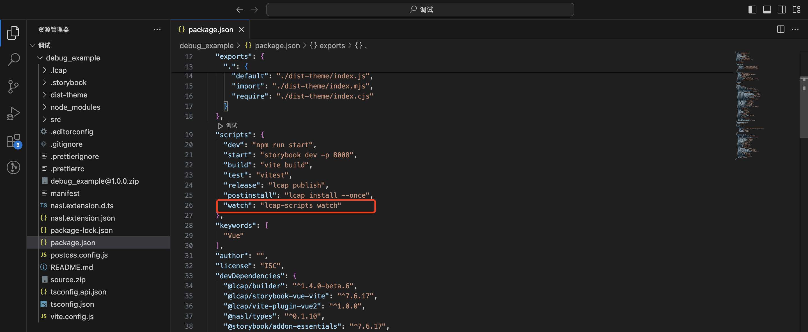
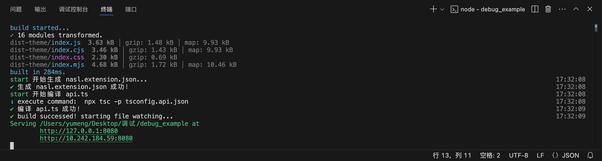
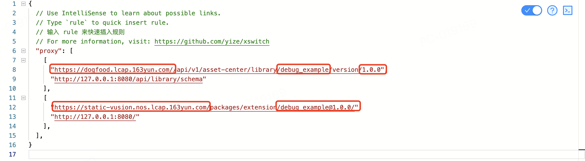
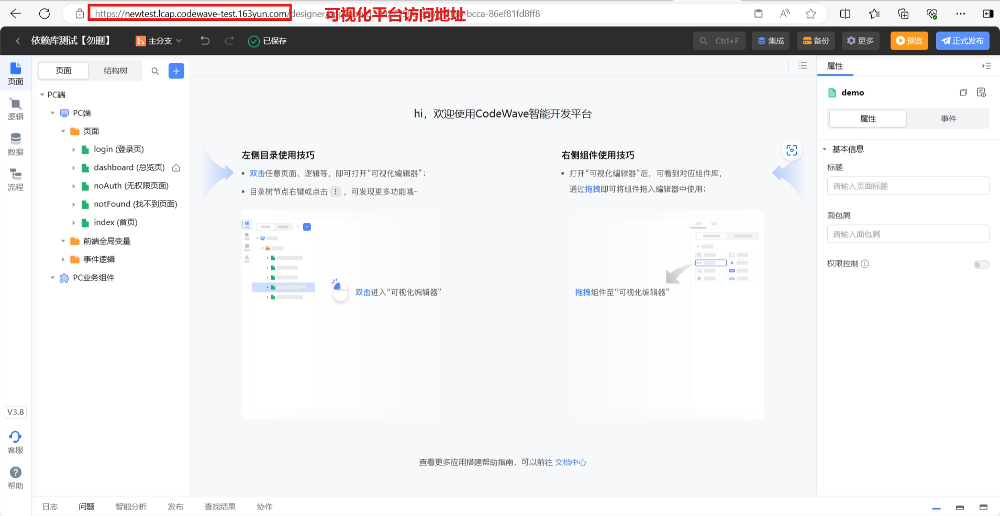
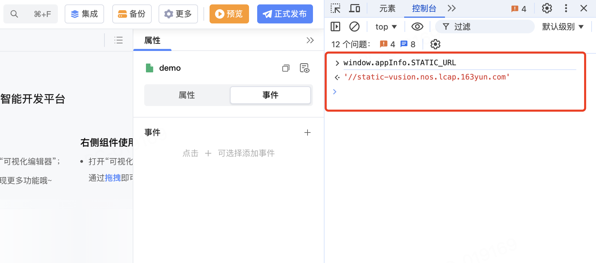
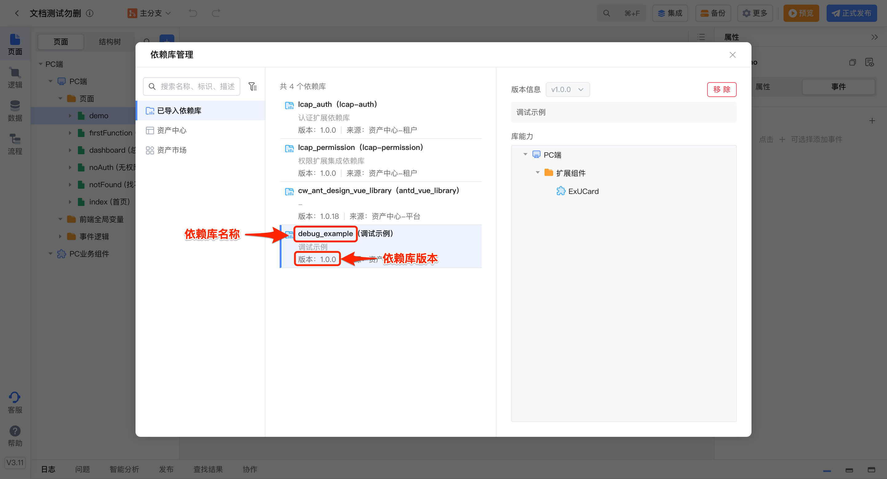

<script setup>
import { VTCodeGroup, VTCodeGroupTab } from '../../.vitepress/components'
</script>

# IDE内调试依赖库

## 1. 功能说明

为实现IDE中依赖库和本地项目文件的联调，开发者可将IDE中的依赖库相关资源代理至本地，并为本地依赖库项目启动调试模式，此时若项目文件有所更新，IDE中依赖库的调试效果便能同步实现更新，从而缩短依赖库项目开发起始到效果核验的链路、提高开发效率。

## 2. 前提条件

1.  调试模式仅在依赖库项目中@lcap/builder版本 >=1.4.0 时支持。执行如下命令将 @lcap/builder 更新至最新版本。

    <VTCodeGroup>
      <VTCodeGroupTab label="npm">

      ```sh
      $ npm install @lcap/builder@latest --save-dev
      ```

      </VTCodeGroupTab>
      <VTCodeGroupTab label="pnpm">

      ```sh
      $ pnpm add @lcap/builder@latest -D
      ```

      </VTCodeGroupTab>
      <VTCodeGroupTab label="yarn">

      ```sh
      $ yarn add @lcap/builder@latest -D
      ```

      </VTCodeGroupTab>
    </VTCodeGroup>

2.  在初次调试之前，需要将待调试的本地依赖库项目发布至资产中心并引入到IDE内，否则在 IDE 内部将无法使用依赖库，进而也不能对其效果进行验收。依赖库的发布和使用具体请参考文档[发布与使用](../get-started/usage.md)。

## 3. 功能实现

### 3.1 启动调试模式

1.  在本地依赖库项目的 package.json 文件中手动添加watch命令。

    ```json
    {
    "scripts": {
        "watch": "lcap-scripts watch"
    }
    }
    ```

    

1.  在终端运行如下命令为本地依赖库项目启动调试模式。

    ```sh
    npm run watch
    ```

    

### 3.2 代理资源到本地

1.  安装代理插件，如[XSwitch](https://chromewebstore.google.com/detail/xswitch/idkjhjggpffolpidfkikidcokdkdaogg?hl=zh-CN\&utm_source=ext_sidebar)。
2.  配置代理插件。

    ```markdown

    {
      // Use IntelliSense to learn about possible links.
      // Type `rule` to quick insert rule.
      // 输入 rule 来快速插入规则
      // For more information, visit: https://github.com/yize/xswitch
      "proxy": [
        [
          "[PLATFORM_URL]/api/v1/asset-center/library/[name]/version/[version]",
          "http://127.0.0.1:8080/api/library/schema"
        ],
        [
          "[STATIC_URL]/packages/extension/[name]@[version]/",
          "http://127.0.0.1:8080/"
        ],
      ],
    }
    ```
    注意替换如上配置为有效信息：

    

- **\[PLATFORM\_URL]**：将其替换为可视化平台访问地址。

    

- **\[STATIC\_URL]**：将其替换为静态资源地址。打开浏览器调试工具，在控制台中打印window\.appInfo.STATIC\_URL即可获取静态资源地址，使用时注意为打印结果补全协议部分，即 https\://。

    

- **\[name]**：将其替换为依赖库的名称。
- **\[version]**：将其替换为依赖库版本号。在IDE的更多->依赖库管理中即可查看已导入依赖库的名称和版本号。

    

## 4. 效果演示

- 确认代理配置正确，重新刷新浏览器即可开始在IDE内调试依赖库。
- 若修改本地依赖库项目文件，保存更改后，调试模式下会自动监听文件变化并重新构建。**刷新页面**或**在依赖库管理中移除该依赖库后重新引入**，即可根据本地依赖库项目同步更新IDE中的依赖库。


