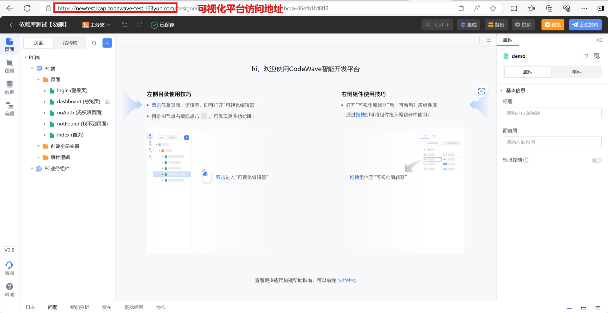
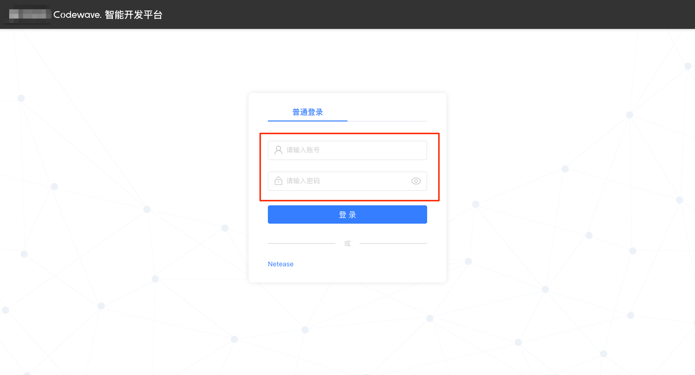
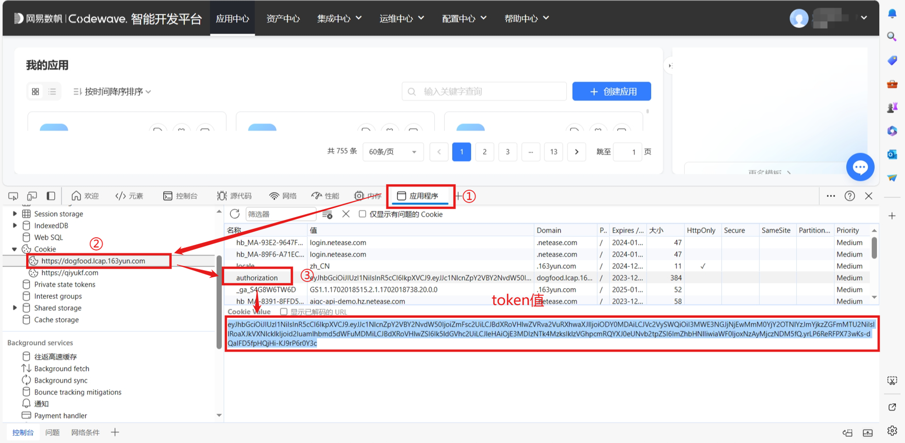
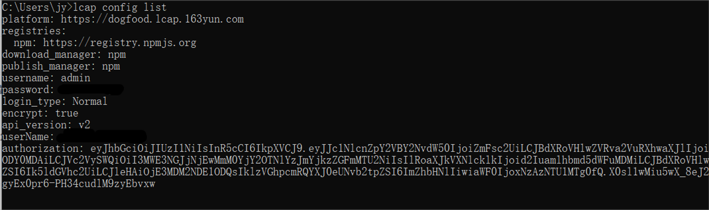
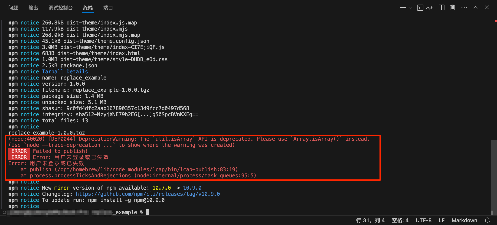

# 环境准备

环境要求：IDE版本>=3.8，node版本 >=18.17

## 1. 安装命令行工具

执行命令，默认安装最新版。
```bash
npm install -g lcap
```

也可以执行如下命令明确要求下载最新版。

```bash
npm install -g lcap@latest
```

## 2. 设置运行环境

设置可视化平台访问地址，\* 为泛指，配置时更换为可视化平台访问地址即可。命令如下所示：

```bash
lcap config set platform *
```



## 3. 设置身份验证信息

### 方式一：适用于通过账号密码登录平台的开发者

1.  设置用户名信息，\*为泛指，配置时更换为平台的登录用户名即可。命令如下所示：

    ```bash
    lcap config set username *
    ```

1.  设置用户密码信息，\*为泛指，配置时更换为平台的登录密码即可。命令如下所示：

    ```bash
    lcap config set password *
    ```

    > 如果设置用户密码时报错，可能是密码中存在不规范字符，建议修改密码后重试。

平台的登录用户名和密码：即登陆平台时使用的账号、密码。



### 方式二：适用于通过手机号验证登录，或其他方式登录平台的开发者

设置lcap工具的授权信息，\*为占位符，配置该项时更换为token值即可。命令如下所示：

```bash
lcap config set authorization *
```

token值来源：登陆平台后，在应用中心页面打开浏览器的控制台-应用程序（Application），找到Cookies中当前页面部分，复制出authorization的Cookies Value值，可参考下图：



## 4. 查看依赖库全局配置

```bash
lcap config list
```

依赖库全局配置如下：



- platform：可视化平台访问地址。
- registries：npm仓库地址 。
- download\_manager：拉包工具。
- publish\_manager：发包工具。
- username：平台的登录用户名。
- password：平台的登录密码。
- login\_type：登录类型。
- api\_version：api版本 。
- authorization：登录token，有此项时不需要设置 username 和 password。

## 5. 常见问题解答

### 发布依赖库显示登录失效



如果通过token值设置身份验证信息，而通常情况下token值会一天一过期，那么造成问题的原因可能是权限过期，需要执行命令更新authorization设置，即重新[设置身份验证信息](#_3-设置身份验证信息)。\* 即token值。

```bash
lcap config set authorization *
```

### 无法修改账号密码

由于通过token设置身份验证信息的方式优先级会高于账户密码，所以在设置authorization后如果改用账户和密码设置身份验证信息，需要先手动删除authorization的设置，即执行下面的命令。

```bash
 config delete authorization
```