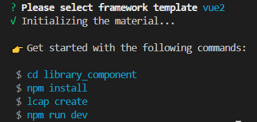
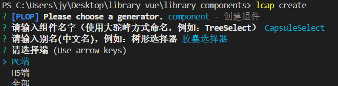
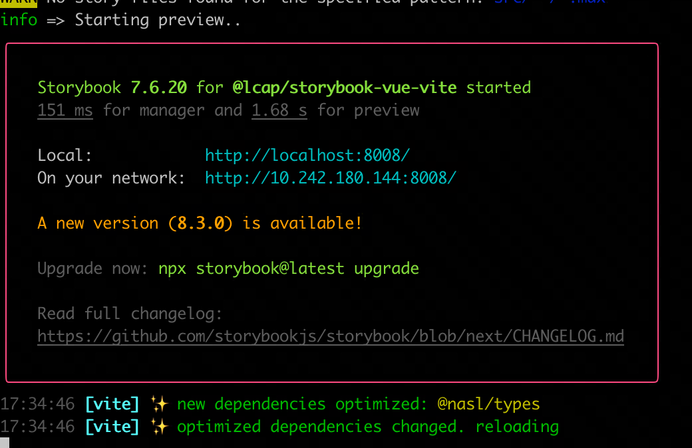
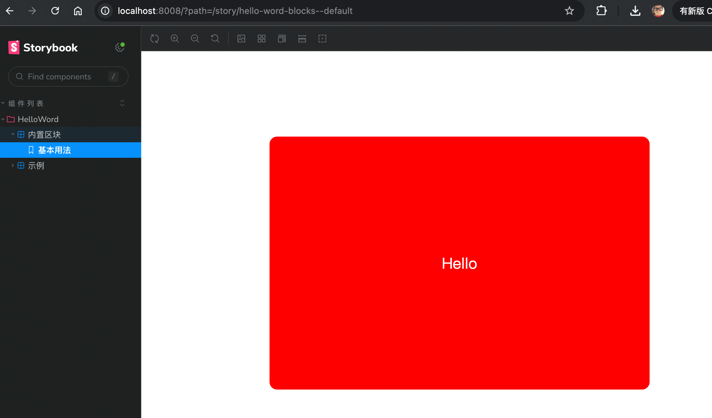

<script setup>
import { VTCodeGroup, VTCodeGroupTab } from '../../.vitepress/components'
</script>

# 创建依赖库

## 1. 初始化依赖库

1.  创建依赖库项目文件。

    ```bash
    lcap init
    ```

1.  输入依赖库名称、选择依赖库模板、选择是否添加 codewave 基础组件包...

    <div class="highlight">

    添加 codewave 基础组件包适用于基于平台提供的[基础组件二次开发](../extend/index.md)，若无需求则无需添加。

    </div>

    ```bash
    please input a package name [输入依赖库名称]
    please select framework template [选择依赖库模板]
    - vue2
    - react

    Whether to add codewave UI package(是否添加 codewave 基础组件包)? (y/N) # [v3.10 新增]please input a package name [输入依赖库名称]
    ```

    

## 2. 安装依赖

在依赖库项目初始化完成后，根据提示，跳转工作路径，进入刚才生成的依赖库文件安装依赖。

1.  跳转工作路径，\*为泛指，配置时更换为依赖库名称即可。命令如下所示：

    ```bash
    cd *
    ```

1.  安装依赖。命令如下所示：

    <VTCodeGroup>
      <VTCodeGroupTab label="npm">

      ```sh
      $ npm install --legacy-peer-deps
      ```

      </VTCodeGroupTab>
      <VTCodeGroupTab label="pnpm">

      ```sh
      $ pnpm i
      ```

      </VTCodeGroupTab>
      <VTCodeGroupTab label="yarn">

      ```sh
      $ yarn
      ```

      </VTCodeGroupTab>
    </VTCodeGroup>

### 目录结构

<VTCodeGroup>
  <VTCodeGroupTab label="Vue2">

  ```
  library_example
  |-- .storybook                      # storybook 配置
  |-- dist-theme                      # 构建生成目录
  |-- src                             # 工程源码目录
  |---- components                    # 扩展组件
  |---- logics                        # logics 逻辑目录
  |---- index.ts                      # 打包入口文件
  |-- ...                             # 其他配置文件，例如 .editor.config, postcss 等
  |-- package.json
  |-- tsconfig.api.json               # api.ts 编译配置
  |-- tsconfig.json                   # 项目 typescript 配置
  |-- vite.config.js                  # vite 构建配置
  ```

  </VTCodeGroupTab>
  <VTCodeGroupTab label="React">

  ```
  library_example
  |-- .storybook                      # storybook 配置
  |-- dist-theme                      # 构建生成目录
  |-- src                             # 工程源码目录
  |---- components                    # 扩展组件
  |---- logics                        # logics 逻辑目录
  |---- index.ts                      # 打包入口文件
  |-- ...                             # 其他配置文件，例如 .editor.config, postcss 等
  |-- package.json
  |-- tsconfig.api.json               # api.ts 编译配置
  |-- tsconfig.json                   # 项目 typescript 配置
  |-- vite.config.js                  # vite 构建配置
  ```

  </VTCodeGroupTab>
</VTCodeGroup>

## 3. 创建组件或逻辑

创建的组件或逻辑，脚⼿架会⾃动⽣成对应的⽂件及配置信息。命令如下所示：
```sh
lcap create
```

执行lcap create命令时，可选择创建组件或者逻辑，默认选择为创建组件。如下：


- 当选择创建组件时，需要设置组件名称（组件使⽤大驼峰的格式命名，如CapsuleSelect），组件别名以及组件的适用终端，默认选择为PC端。如下：

    

- 当选择创建逻辑时，需要设置逻辑名称（逻辑使⽤小驼峰的⽅式命名，如demoLogic），逻辑别名以及逻辑的适用终端，默认选择为PC端。如下：

    

<div class="highlight">

一个依赖库中可以包含多个组件、逻辑，重复执行创建的命令即可添加新的组件或逻辑，当依赖库在应用中被引入时，这些组件和逻辑将一并引入。

</div>


## 4. 本地开发启动

```
npm run dev
```





<div class="highlight">

**常见问题**

在本地启动时，如果出现缺少依赖项而无法启动的问题，导致原因可能是因为本地有多个项目同时启动。

**解决方案**

删除 node\_modules 后重新安装，再尝试启动项目。

</div>


## 5. 本地开发测试

执行`npm run dev`开启本地组件开发调试。

本项目是以 storybook 和 vite 作为基础工程模式来构建的。其中，storybook 为项目的 UI 组件开发提供了一个独立且高效的开发环境，它能够让开发者专注于组件本身的功能完善、展示效果优化以及文档生成，使得组件开发过程更加清晰、便捷；而 vite 则为整个项目的开发效率和性能提升提供了有力支持。

- 若需要自定义编写用于调试的 Demo，请前往[How to write stories • Storybook docs](https://storybook.js.org/docs/writing-stories)学习。
- 若需要修改默认的工程构建配置，请前往[vite 官网](https://vitejs.dev/)学习。


<style>
 .highlight {
      border: 1px solid #679CF8; /* 添加边框 */
      border-radius: 6px;
      background-color: #F8FCFF; /* 添加底色 */
      padding: 10px 20px 10px 20px;
      margin-bottom:20px;
      margin-top:20px;
      box-shadow: 0 2px 4px rgba(0, 0, 0, 0.2);
  }
</style>