# 依赖库发布与使用

## 1. 发布依赖库

在完成组件或逻辑的代码编写和相关自定义配置后，需将依赖库打包发布至CodeWave智能开发平台的资产中心。依赖库发布成功后即可在CodeWave智能开发平台IDE中导⼊使⽤。目前，依赖库发布有两种方式，两种方式在功能上没有区别。

### 方式一：先将依赖库代码打包，再发布

打包命令如下：

```sh
npm run build
```

打包结果如下：


打包内容如下：
```
|-- dist-theme    构建产物目录
|---- index.js    依赖库运行文件
|---- index.css   依赖库运行文件
|---- theme       主题预览文件
|---- theme.config.json 主题变量配置文件
|---- i18n.json   国际化配置
|-- mainifest     资产文件清单（后端解析此文件上传到对象存储）
|-- nasl.extension.d.ts  组件类型声明
|-- nasl.extension.json  依赖库配置文件产物
|-- source.zip    源码文件
|-- zip.tgz       发布包产物（构建完成后会删掉）
|-- xxx@1.0.0.zip  用于上传的依赖库包
```

将打包好的依赖库压缩包，上传⾄CodeWave智能开发平台中并发布到平台的资产中心-依赖库页面，具体操作步骤如下：

1.  前往**资产中心**-**租户资产**-**依赖库**页面，点击“**手动上传**”按钮。

    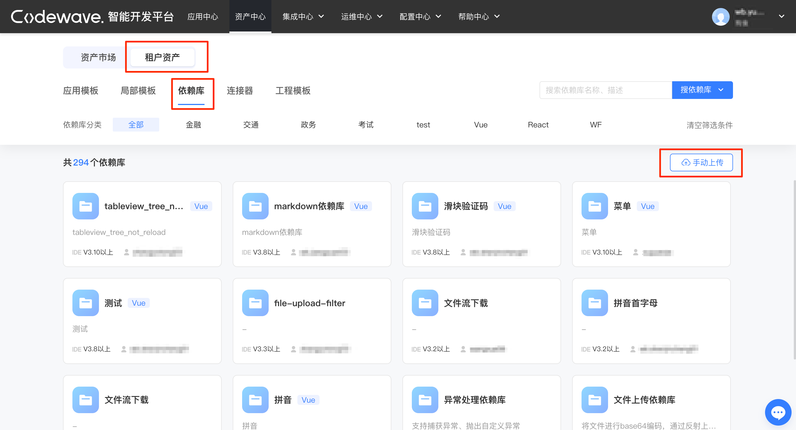

1.  将打包好的依赖库压缩包上传完成后，点击“**确定**”按钮。

    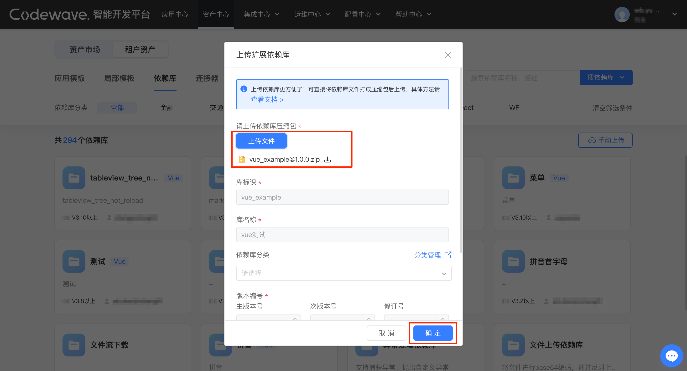

扩展依赖库相关信息说明：

- 库标识：平台会根据上传的依赖库压缩包自动解析，默认置灰状态不可更改。
- 库名称：平台会根据上传的依赖库压缩包自动解析，默认置灰状态不可更改。
- 库分类：可在此设置上传依赖库的类型，便于后续分类查找。非必填项。
- 发布版本：平台会根据上传的依赖库压缩包自动解析，默认置灰状态不可更改。
- 描述：在此可添加上传的依赖库的相关描述。非必填项。

依赖库发布成功后可以到平台的**资产中心依赖库**页面查看。

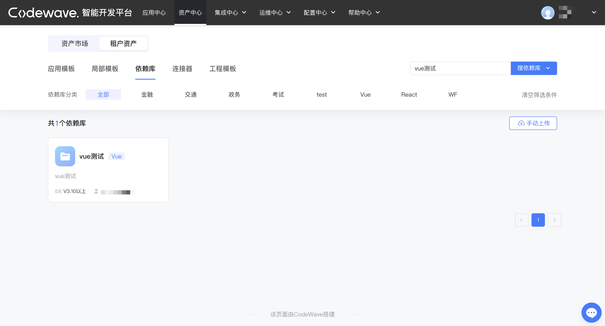

### 方式二：直接发布依赖库

发布命令如下：

```sh
npm run release
```

npm run release 命令集成了打包与发布功能，会⽣成 nasl.extension.json 文件，即依赖库配置文件产物，并将打包好的依赖库直接发布到平台的**资产中心** -> **依赖库**页面。

发布结果如下：


## 2. 使用依赖库

### 前提条件：导入依赖库

#### 方式一：从依赖库管理中导入

1.  在CodeWave智能开发平台IDE页面，点击“**更多**”按钮，在弹出框中选择依赖库管理点击进入依赖库管理。

    

1.  在依赖库管理弹窗内的搜索框中输入“依赖库名称”，然后选择资产中心，再选择需要的依赖库，点击“**导入依赖库**”按钮即可。

    

#### 方式二：在组件面板中搜索资产后导入

该方式适用于需要通过依赖库导入组件的场景。

1.  在页面IDE右侧的组件面板中点击“搜资产”。

    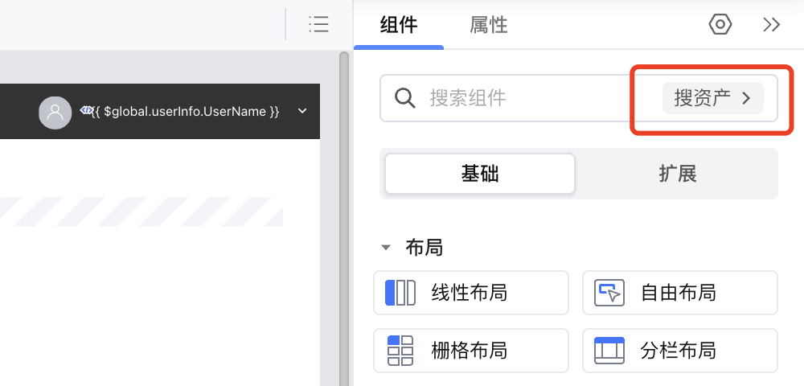

1.  在搜索框中搜索依赖库名称。搜索后可选择直接导入或从依赖库管理中打开并查看。

    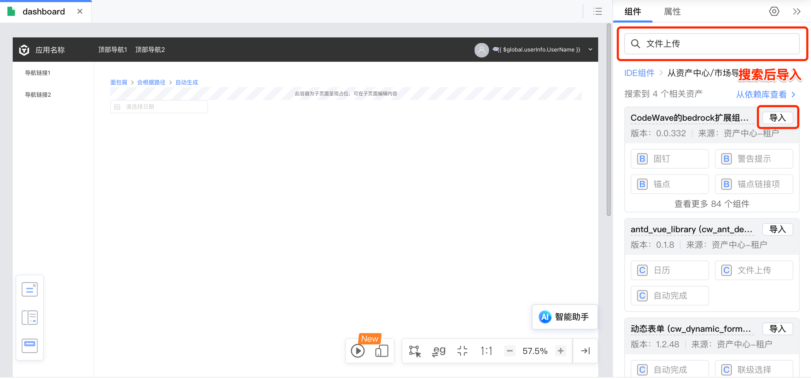

#### 方式三：在调用逻辑中搜索资产后导入

该方式适用于需要通过依赖库导入逻辑的场景。

1.  在页面逻辑中拖拽调用逻辑组件，在选择逻辑时点击“搜资产”。

    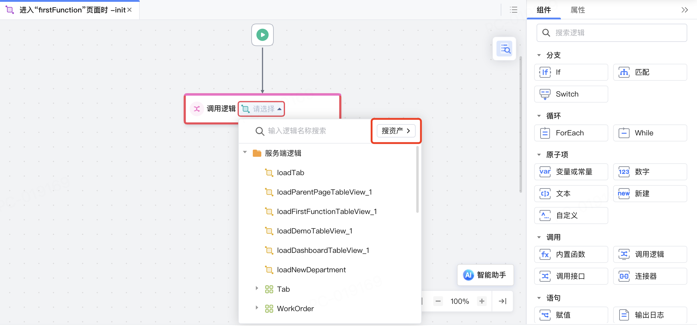

1.  在搜索框中搜索依赖库名称。搜索后可选择直接导入或从依赖库管理中打开并查看。
   
    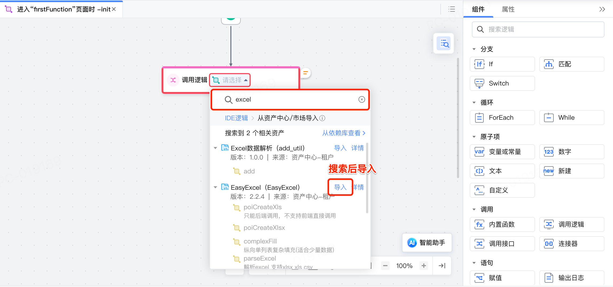


### 组件的使用

在CodeWave智能开发平台IDE页面点击组件，切换到扩展下，找到引入的依赖库中的组件拖拽至页面即可使用。

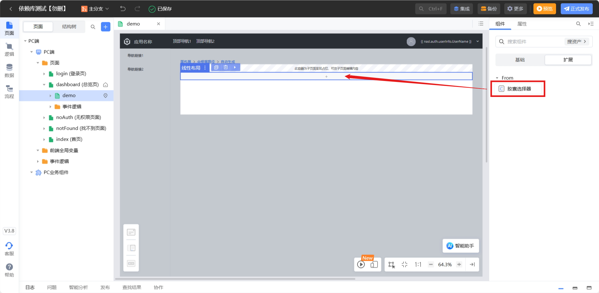

### 逻辑的使用

逻辑的使用方式和其他逻辑一致，位置在调用逻辑-系统逻辑-当前依赖库下面。

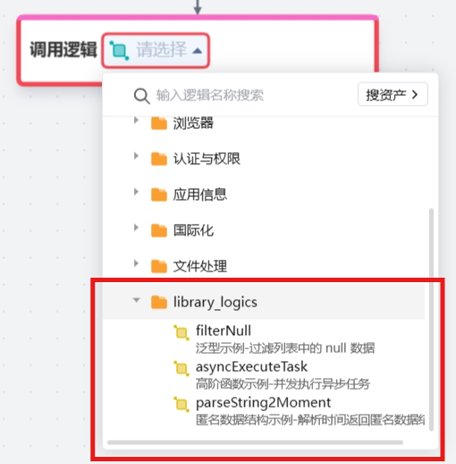

## 3. 升级依赖库

当由于组件或逻辑能力更新等原因使依赖库的源代码发生变动后，需要重新发布依赖库。

但为了防止新的依赖库与已有的依赖库产生冲突，特别是在已有的依赖库已经被使用的情况下，即使删除资产中心中已有的依赖库，只要已有的依赖库仍在应用中被使用，就容易导致新的依赖库被识别错误。

合理的使用姿势为升级版本号后再上传至资产中心，区分不同版本的依赖库，而不建议删除资产中心已有的依赖库再重新上传修改后的原版本号依赖库。

- 设置依赖库版本号，\*为泛指，配置时更换为版本号即可。命令如下所示：

    ```
    npm version *
    ```

- 也可在 package.json文件中，手动编辑依赖库的版本号。

## 4. 删除依赖库

可在资产中⼼-依赖库，删除整个依赖库模板或者选择当前依赖库的某⼀个版本进⾏删除。

当该依赖库只有一个版本时，直接删除模板即可。

<div class="highlight">

删除依赖库后，不会影响已经导入依赖库的使用。

为了防止使用中的依赖库与新导入的依赖库存在版本冲突，因此建议仅在依赖库被完全弃用时执行删除。

</div>


当该依赖库有多个版本时，可选择某个版本进行删除。

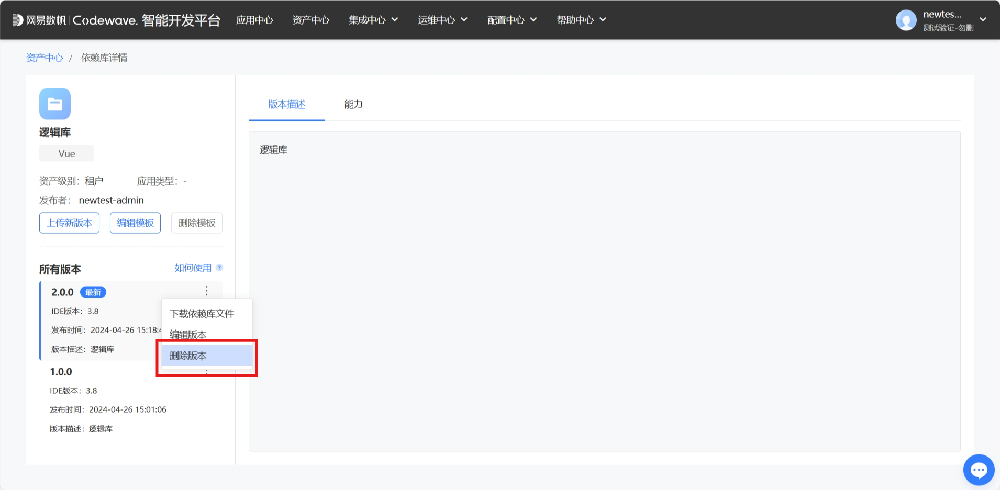

## 5. 常见问题解答

### 应用导出源码后缺少依赖库

在3.10版本之前，将IDE应用源码导出后，需将依赖库发布到npm官网，才可正常使用，在依赖库项目根目录下执行npm publish即可将依赖库发布到 npm 官网。

### 发布依赖库失败

发布依赖库时需要至少识别到 Vue 分类标签，否则会导致依赖库发布失败。

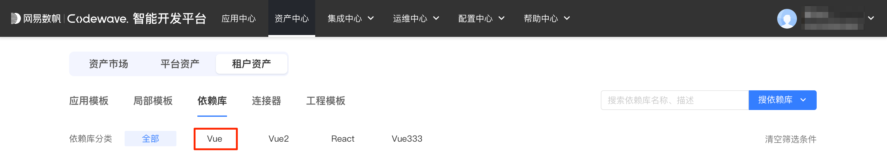

若依赖库分类不包含 Vue，请前往**配置中心**->**资产中心**添加。具体操作步骤如下：

1.  点击配置中心->资产配置进入资产配置界面，选择依赖库分类，点击“新增分类”。

    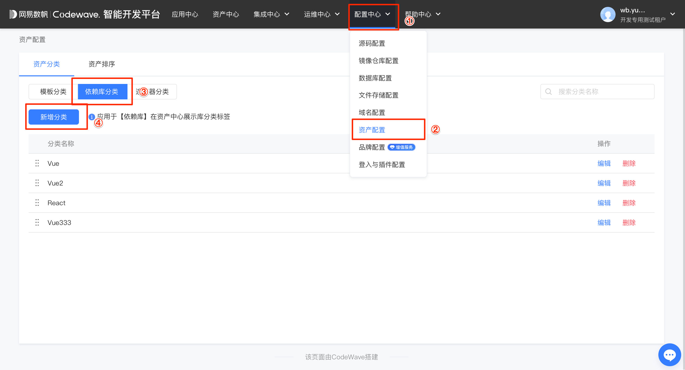

2.  分类名称命名为 Vue 后，点击“确定”。

    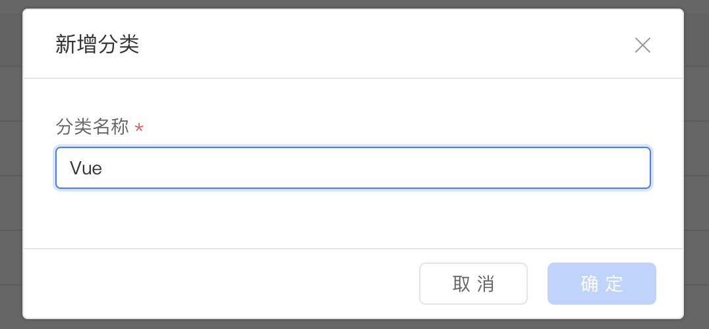


<style>
 .highlight {
      border: 1px solid #679CF8; /* 添加边框 */
      border-radius: 6px;
      background-color: #F8FCFF; /* 添加底色 */
      padding: 10px 20px 10px 20px;
      margin-bottom:20px;
      margin-top:20px;
      box-shadow: 0 2px 4px rgba(0, 0, 0, 0.2);
  }
</style>